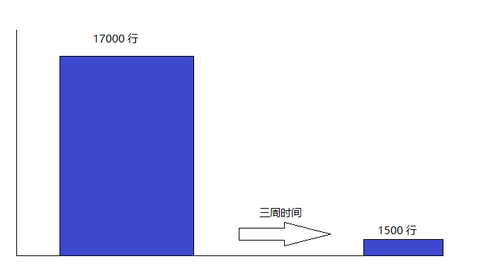
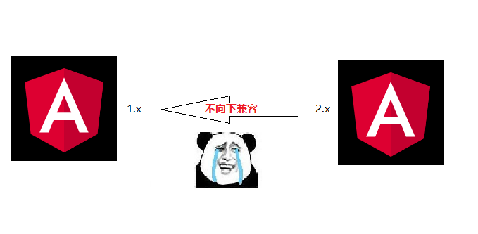
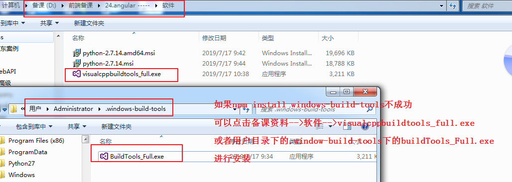
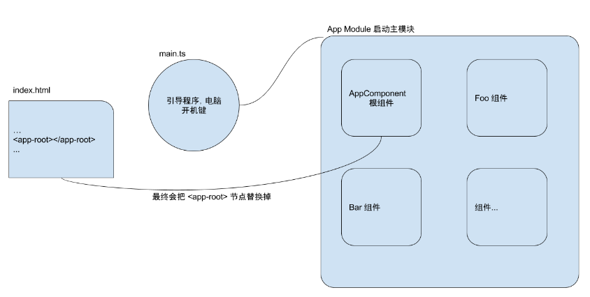
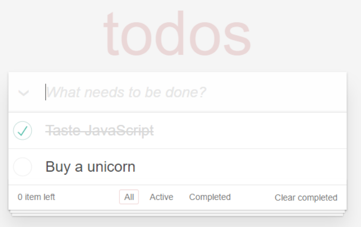
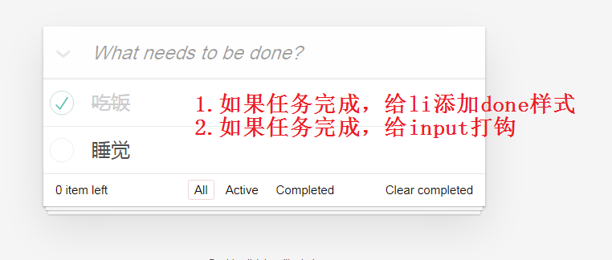
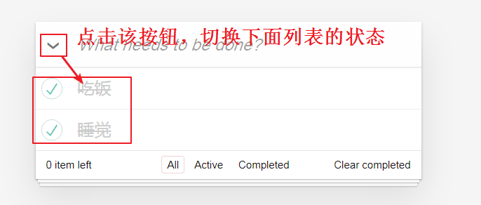
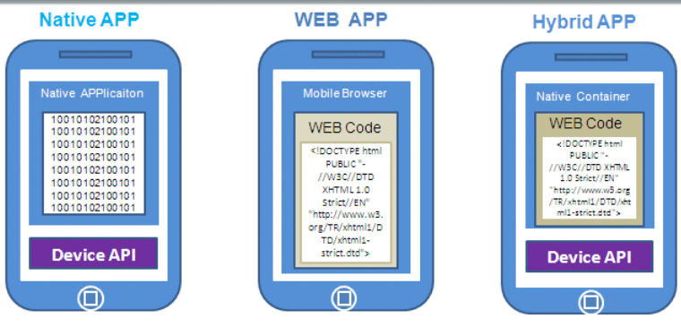
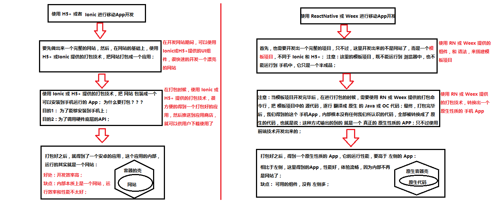
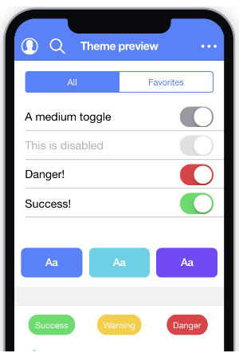

## 1.Angular 介绍


### 1.1 Angular是什么

Angular（读音['æŋgjʊlə]）是一套用于构建用户界面的 JavaScript 框架。由 Google 开发和维护，主要被用来开发单页面应用程序。

- 类似于 [Vue.js](https://cn.vuejs.org/)
  + MVVM（提供了双向数据绑定）
  + 组件化
  + 模块化
  + 指令
  + ......
- 由 Google 开发和维护
- 开发单页面应用程序（SPA） 

### 1.2 特性

- MVVM
- 组件化
- 模块化
- 指令
- 服务
- 依赖注入(很多概念从后台开发中引入的)
- TypeScript
- ...

### 1.3 Angular发展历史

#### 1.3.1 Angular1

2009年，Misko hevery 和 Adam abrons 在业余时间打造了 `GetAngular`


Misko Hevery 接手了 Google 内部的一个项目 `Feedback` ，该项目经过6个月的迭代代码量已经达到了17000行。项目的开发和维护已经变得非常的困难。所有 Misko 就决定用 `GetAngular` 重写这个项目。

结果就是小伙子成功了，使用 `GetAngular` 之后该项目从17000行缩减到了1500行，前后仅仅使用了三周时间。



Misko 领导一看，小伙子厉害啊，同时也看到了 `GetAngular` 所带来的商业价值，所以决定把  `GetAngular` 正式立项，组织专职团队开发和维护。

Abrons 后来离开了这个计划，但在 Google 工作的 Hevery 和一些谷歌员工如 Igor Minár 和 Vojta Jína 等则继续开发维护此库。

由于已不再是个人项目，所以开发团队将 `GetAngular` 重新命名为了 `AngularJS` 。


至此，AngularJS 就进入了漫长的发展迭代阶段。

- 经过了3年的发展，AngularJS 在2012年6月份，`1.0.0` 版本正式推出。
- AngularJS 在1.2之后的版本不再支持 IE 6和7
- AngularJS 在 1.3 之后不再支持 IE8
- AngularJS 在 1.5 增加了类似组件化的开发方式
  - 为过渡到 Angular2 做铺垫
- AngularJS `1.x.x` 已发布到了 `1.6.x`

#### 1.3.2 Angular1的困境

- 饱受诟病的性能问题
  - 脏检查 (<https://segmentfault.com/a/1190000010433675>)
- 落后于当前 Web 发展理念
  - 例如组件化
  - 模块化支持不好
- 对移动端支持不够友好

#### 1.3.3 Angular 2 横空出世

<https://angular.io/>

Angular 1.x 由于问题太多，历史包袱太重，重构几乎不可能。

不过早在2014年3月，官方博客就有提及开发新版本 Angular 的计划。

2014年9月下旬一个大会上，`Angular2` 正式亮相。

2016年9月15号，`Angular2` 正式发布。

由于 ng2 几乎完全重写了 ng1 ，所以官方把2之后的版本都称之为 Angular。


Angular 2 之后的正式 Logo：


新版本发布了，那用户如何从 1 升级到 2 呢？



那到底要不要更新呢？


#### 1.3.4 ng2 相比 ng1

- 移除了 controller+$scope 的设计方式，改用了当前主流的组件化构建
- 相比 ng1 性能更好(脏检查机制已做优化)
- 优先为移动端设计
- 更贴合未来标准
  - EcmaScript 6  (TypeScript)
  - Web Component
- TypeScript
- 反正就是更现代化，更好了......

#### 1.3.5 Angular现状

- 自 Angular 2 之后，官方承诺之后的版本都会兼容到 Angular 2
- 当前 Angular 最新发布版为 `8.x.x`
- 新版的 Angular 在 Github 上也已收获了 3万+ ☆
- 使用量低于 React 和 Vue

### 1.4 相关链接

- [维基百科 - Angular](https://zh.wikipedia.org/wiki/Angular)
- [AngularJS 1.x.x 官网](https://angularjs.org/)
- [Angular 官网](https://angular.io/)
- [Angular Github](https://github.com/angular/angular)
- [Angular 官方文档](https://angular.io/docs)
- [Angular 官方教程](https://angular.io/tutorial)
- [Angular APi文档](https://angular.io/api)

## 2.Angular-cli

### 2.1 创建Angular-cli项目

```javascript
1.环境要求
   Node 10.9.0 or higher
   NPM 3 or higher
   Python2.7.1                  
   C++ 编译工具
   
   //Python下载地址
   https://www.python.org/downloads/release/python-271/
   python --version
   
   //C++编译工具   windows7/Vista依赖于.NET Framework 4.5.1
   //npm install --global --production windows-build-tools
   //如果安装出错，可以去用户目录下的.windows-build-tools下选择安装文件双击运行

2.安装Angular-cli
   npm install -g @angular/cli
   ng help
   ng new <项目名称>
   ng serve    //默认占用 4200 端口号，可以通过下面选项配置
   ng serve --port 4201
```



### 2.2 Angular-cli项目目录结构



```
.
├── e2e 端到端测试（暂且不关心）
├── node_modules npm安装的第三方包
├── src 存放业务源码
├── .angular.json            AngularCLI脚手架工具配置文件
├── .editorconfig            针对编辑器的代码风格约束
├── .gitignore                 Git仓库忽略配置项
├── karma.conf.js            测试配置文件（给karma用的，暂且不用关心）
├── package.json            项目包说明文件
├── README.md             项目说明文件
├── tsconfig.json             TypeScript配置文件
└── tslint.json                  TypeScript代码风格校验工具配置文件（类似于 eslint）
```

```javascript
//npm scripts介绍
...
"scripts": {
    "ng": "ng", 运行查看 Angular CLI 脚手架工具使用帮助
    "start": "ng serve", 运行开发模式
    "build": "ng build --prod", 运行项目打包构建（用于发布到生成环境）
    "test": "ng test", 运行karma单元测试
    "lint": "ng lint", 运行TypeScript代码校验
    "e2e": "ng e2e" 运行protractor端到端测试
  },
...
```

```javascript
main.js
- 描述：模块化启动入口
- 职责：加载启动根模块
```

```javascript
AppModule
- 描述：项目根模块
- 职责：把组件、服务、路由、指令等组织到一起，设置AppComponent为根组件


import { BrowserModule } from '@angular/platform-browser';
import { NgModule } from '@angular/core';

import { AppRoutingModule } from './app-routing.module';
import { AppComponent } from './app.component';
import { FooComponent } from './foo/foo.component';
import { LoginComponent } from './home/login/login.component';

@NgModule({
  //声明模块资源：组件、指令、服务
  declarations: [
    AppComponent,
    FooComponent,
    LoginComponent
  ],
  //依赖模块
  imports: [
    BrowserModule,
    AppRoutingModule
  ],
  //指定应用程序的根级别需要使用的service
  providers: [],
  //指定启动组件
  bootstrap: [AppComponent]
})
export class AppModule { }
```

```javascript
AppComponent
- 描述：项目根组件
- 职责：替换掉 index.html 文件中的 <app-root></app-root> 节点
```

```
app.component.spec.ts      单元测试文件，暂时不用管他
```

## 3.Angular核心语法

### 3.1 组件

#### 3.1.1 组件基本使用

```javascript
#1.app.component.ts
import { Component } from '@angular/core';

//在Angular中，组件就是一个类
//@Component 组件的装饰器 (组件的元数据)
// selector: 用来定义组件渲染的标签名称(index.html中有一个app-root)  其实就是组件的名称
// templateUrl: 用来指定组件的页面模板
// styleUrls : 一个数组，用来存放组件相关的样式文件
@Component({
  selector: 'app-root',
  templateUrl: './app.component.html',
  styleUrls: ['./app.component.less']
})

export class AppComponent {
  //这里面用来放组件的数据和方法
  title = 'testng2';
  count = 0;
  increment = ()=>{
    this.count ++;
  }
}


#2.app.component.html
<h3>{{count}}</h3>
<button (click)="increment()">点我+1</button>
```

#### 3.1.2 组件的创建

```shell
# 创建组件  组件会被创建到app目录下
ng generate component foo
ng generate component /home/login

# app.component.html中使用上面创建的组件
<app-foo></app-foo>
<app-login></app-login>
```

### 3.2 指令与模板语法

```javascript
NgClass  作用：添加或移除一组 CSS 类

NgStyle  作用：添加或移除一组 CSS 样式

NgModel 作用：双向绑定到 HTML 表单元素

NgIf  作用：根据条件添加或移除 DOM

NgSwitch  作用：类似于 JavaScript 中的 switch 语句，根据条件渲染多个选项中的一个。

NgFor 作用：列表渲染
```

#### 3.2.1 插值表达式

```javascript
//{{js表达式}}
//[xx] = "js表达式"     angular中的[]类似于vue中的v-bind
<p>Message: {{ msg }}</p>

<p [innerHTML]="msg"></p>
```

```html
<!-- 写法一 -->


<!-- 写法二，推荐 -->


<!-- 写法三 -->

```

在布尔特性的情况下，它们的存在即暗示为 `true`，属性绑定工作起来略有不同，在这个例子中：

```html
<button [disabled]="isButtonDisabled">Button</button>

如果 isButtonDisabled 的值是 null、undefined 或 false，则 disabled 特性甚至不会被包含在渲染出来的 <button> 元素中。
```

#### 3.2.2 使用 JavaScript 表达式

```html
<p>1 + 1 = {{ 1 + 1 }}</p>
<p>{{ num + 1 }}</p>
<p>{{ isDone ? '完了' : '没完' }}</p>
<p>{{ title.split('').reverse().join('') }}</p>

<p [title]="title.split('').reverse().join('')">{{ title }}</p>
```

编写模板表达式所用的语言看起来很像 JavaScript。 很多 JavaScript 表达式也是合法的模板表达式，但不是全部。

Angular 遵循轻逻辑的设计思路，所以在模板引擎中不能编写非常复杂的 JavaScript 表达式，这里有一些约定：

- 赋值 (`=`, `+=`, `-=`, ...)
- `new` 运算符
- 使用 `;` 或 `,` 的链式表达式
- 自增或自减操作符 (`++`和`--`)

#### 3.2.3 列表渲染

基本用法：

```typescript
export class AppComponent {
  heroes = ['Windstorm', 'Bombasto', 'Magneta', 'Tornado'];
}
```

```html
<p>Heroes:</p>
<ul>
  <li [id]="'list-' + hero" *ngFor="let hero of heroes">
    {{ hero }}
  </li>
</ul>
```

也可以获取 index 索引：

```html
<div *ngFor="let hero of heroes; let i=index">{{i + 1}} - {{hero.name}}</div>
```

#### 3.2.4 条件渲染

```html
<div *ngIf="heroes.length>3; else templateName">有很多英雄</div>
<ng-template #templateName>没有很多英雄</ng-template>
```

#### 3.2.5 NgSwitch

NgSwitch 的语法比较啰嗦，使用频率小一些。

```html
<div [ngSwitch]="currentHero">
  <div *ngSwitchCase="'Windstorm'">Windstorm</div>
  <div *ngSwitchCase="'Bombasto'">Bombasto</div>
  <div *ngSwitchCase="'Magneta'">Magneta</div>
  <div *ngSwitchDefault>Tornado</div>
</div>
```

#### 3.2.6 自定义指令

```javascript
自定义指令：https://www.angular.cn/guide/attribute-directives

ng generate directive highlight

#highlight.directive.ts
import { Directive,ElementRef  } from '@angular/core';

@Directive({
  selector: '[appHighlight]'
})
export class HighlightDirective {
  constructor(el: ElementRef) {
    el.nativeElement.style.backgroundColor = 'yellow';
  }
}

#app.component.html
<p appHighlight>Highlight me!</p>
```

#### 3.2.7 事件处理

事件绑定只需要用圆括号把事件名包起来即可：

```html
<button (click)="onSave()">Save</button>
```

可以把事件对象传递到事件处理函数中：

```html
<button (click)="onSave($event)">On Save</button>
```

也可以传递额外的参数（取决于你的业务）：

```html
<button (click)="onSave($event, 123)">On Save</button>
```

当事件处理语句比较简单的时候，我们可以内联事件处理语句：

```html
<button (click)="message = '哈哈哈'">内联事件处理</button>
```

我们可以利用 **属性绑定 + 事件处理** 的方式实现表单文本框双向绑定：

```html
<input [value]="message"
       (input)="message=$event.target.value" >
```

事件绑定的另一种写法，使用 `on-` 前缀的方式：

```html
<!-- 绑定事件处理函数 -->
<button on-click="onSave()">On Save</button>
```

#### 3.2.8 双向绑定

```html
<p>{{ message }}</p>
<input type="text" [(ngModel)]="message">
```

运行之后你会发现报错了，原因是使用 `ngModel` 必须导入 `FormsModule` 并把它添加到 Angular 模块的 `imports` 列表中。

导入 `FormsModule` 并让 `[(ngModel)]` 可用的代码如下：

```typescript
import { BrowserModule } from '@angular/platform-browser';
import { NgModule } from '@angular/core';
+++ import { FormsModule } from '@angular/forms';

import { AppComponent } from './app.component';

@NgModule({
  declarations: [
    AppComponent
  ],
  imports: [
    BrowserModule,
+++ FormsModule
  ],
  providers: [],
  bootstrap: [AppComponent]
})
export class AppModule { }
```

通过以上的配置之后，你就可以开心的在 Angular 中使用双向数据绑定了。

```javascript
//多行文本
<textarea cols="30" rows="10" [(ngModel)]="message"></textarea>
```

```javascript
//复选框
<h3>复选框</h3>
<input type="checkbox" [(ngModel)]="seen">
```

```javascript
//单选按钮
<input type="radio" [value]="0" [(ngModel)]="gender"> 男
<input type="radio" [value]="1" [(ngModel)]="gender"> 女
<p>选中了：{{ gender }}</p>
```

```javascript
//下拉列表
<select [(ngModel)]="hobby">
  <option [value]="0">吃饭</option>
  <option [value]="1">睡觉</option>
  <option [value]="2">打豆豆</option>
</select>
<p>选中的爱好：{{ hobby }}</p>
```

#### 3.2.9 Class绑定

- https://angular.io/guide/template-syntax#ngClass

a) 普通写法

```javascript
//我们也可以通过类绑定或样式绑定来显示或隐藏一个元素。
//  isSpecial = true

<div [class.hidden]="!isSpecial">Show with class</div>
<div [class.hidden]="isSpecial">Hide with class</div>
```

```html
<!-- 标准class绑定写法 -->
<div class="bad curly special">Bad curly special</div>

<!--使用bind来添加指定的class  -->
<div class="bad curly special"
     [class]="'bad'">Bad curly</div>

<!--通过isSpecial属性来切换special样式 -->
<div [class.special]="isSpecial">The class binding is special</div>
```

b) 使用NgClass指令 

`NgClass` 指令接收一个对象，对象的 `key` 指定 css 类名，value 给定一个布尔值，当布尔值为真则作用该类名，当布尔值为假则移除给类名。

语法规则：

```html
<div [ngClass]="{
  css类名: 布尔值,
  css类名: 布尔值
}">测试文本</div>
```

基本示例：

```css
.saveable{
    font-size: 18px;
} 
.modified {
    font-weight: bold;
}
.special{
    background-color: #ff3300;
}
```

```typescript
currentClasses = {
    'special': true,
    'modified':true,
    'saveable':true
};
```

```html
<div [ngClass]="{'special':true,'saveable':true}">This div is initially saveable, unchanged, and special</div>
<div [ngClass]="currentClasses">This div is initially saveable, unchanged, and special</div>
```

#### 3.2.10 Style绑定

a) 普通写法

通过**样式绑定**，可以设置内联样式。

样式绑定的语法与属性绑定类似。 但方括号中的部分不是元素的属性名，而由**style**前缀，一个点 (`.`)和 CSS 样式的属性名组成。 形如：`[style.style-property]`。

```html
<button [style.color]="isSpecial ? 'red': 'green'">Red</button>
<!-- 也可以 backgroundColor -->
<button [style.background-color]="canSave ? 'cyan': 'grey'" >Save</button>

<div [style.display]="isSpecial ? 'block' : 'none'">Show with style</div>
<div [style.display]="isSpecial ? 'none'  : 'block'">Hide with style</div>
```

有些样式绑定中的样式带有单位。在这里，以根据条件用 “em” 和 “%” 来设置字体大小的单位。

```html
<button [style.font-size.em]="isSpecial ? 3 : 1" >Big</button>
<button [style.font-size.%]="!isSpecial ? 150 : 50" >Small</button>
```

> 提示：*样式属性*命名方法可以用[中线命名法](https://angular.cn/guide/glossary#dash-case)，像上面的一样 也可以用[驼峰式命名法](https://angular.cn/guide/glossary#camelcase)，如`fontSize`。

b) 使用NgStyle指令

虽然这是设置单一样式的好办法，但我们通常更喜欢使用 [NgStyle指令](https://angular.cn/guide/template-syntax#ngStyle) 来同时设置多个内联样式。

```typescript
 currentStyles = {
    'font-style': 'italic',
    'font-weight': 'bold',
    'font-size': '24px'
};
```

```html
<div [ngStyle]="currentStyles">
  This div is initially italic, normal weight, and extra large (24px).
</div>
```

ngStyle 这种方式相当于在代码里面写 CSS 样式，比较丑陋，而且将来不太好修改，非常不建议这样写（足够简单的情况除外）。

#### 3.2.11 模板引用变量

**模板引用变量**通常用来引用模板中的某个DOM元素，它还可以引用Angular组件或指令或[Web Component](https://developer.mozilla.org/en-US/docs/Web/Web_Components)。

使用井号 (#) 来声明引用变量。 `#phone`的意思就是声明一个名叫`phone`的变量来引用`<input>`元素。

```html
<input #phone placeholder="phone number">
```

我们可以在模板中的任何地方引用模板引用变量。 比如声明在`<input>`上的`phone`变量就是在模板另一侧的`<button>`上使用的。

```html
<input #phone placeholder="phone number">

<!-- lots of other elements -->

<!-- phone refers to the input element; pass its `value` to an event handler -->
<button (click)="callPhone(phone.value)">Call</button>
```

> 大多数情况下，Angular会把模板引用变量的值设置为声明它的那个元素。在上面例子中，`phone` 引用的是表示*电话号码*的`<input>`框。 "拨号"按钮的点击事件处理器把这个*input*值传给了组件的`callPhone`方法。 不过，指令也可以修改这种行为，让这个值引用到别处，比如它自身。 `NgForm`指令就是这么做的。

模板引用变量使用注意：

- 模板引用变量的作用范围是*整个模板*。 不要在同一个模板中多次定义同一个变量名，否则它在运行期间的值是无法确定的。
- 如果我在模板里面定义的局部变量和组件内部的属性重名会怎么样呢
  - 如果真的出现了重名，Angular 会按照以下优先级来进行处理
  - `模板局部变量 > 指令中的同名变量 > 组件中的同名属性`
- 我们也可以用`ref-`前缀代替`#`。 下面的例子中就用把`fax`变量声明成了`ref-fax`而不是`#fax`。

```html
<input ref-fax placeholder="fax number">
<button (click)="callFax(fax.value)">Fax</button>
```

```javascript
//在js代码中使用模板引用变量
import { Component, OnInit,ViewChild,ElementRef } from '@angular/core';

@Component({
  selector: 'app-login',
  templateUrl: './login.component.html',
  styleUrls: ['./login.component.less']
})
export class LoginComponent implements OnInit {
  //ViewChild可以在js代码中获取页面引用的模板
  @ViewChild('phone') phone: ElementRef;

  constructor() { 
  }

  isSpecial = true;

  currentClasses = {
    saveable: true,
    modified: true,
    special: false
  };

  currentStyles = {
    'font-style': 'italic',
    'font-weight': 'bold',
    'font-size': '24px'
  };

  currentTime=new Date();

  callPhone = (value)=>{
    //获取页面模板 phone中的内容
    console.log(this.phone.nativeElement.value)
  };

  ngOnInit(): void {
  }

}
```


#### 3.2.12 过滤器

在 Angular 中，过滤器也叫管道。它最重要的作用就是用来格式化数据的输出。

举个简单例子：

```typescript
currentTime=new Date();
```

```html
<h1>{{currentTime | date:'yyyy-MM-dd HH:mm:ss'}}</h1>
```

Angular 一共内置了一些过滤器：https://angular.io/api?type=pipe。

```javascript
//货币转换 currency
{{123 | currency }}  //$123
{{123 | currency:'￥' }}  //￥123

//格式化时间 date
{{new Date() | date:'yyyyMMdd'}}  //2016/11/02
yyyy/yy : 2016 / 16（年）
MM： 11  （月）
dd：02 （日）
h/hh : 8 / 08 （时）
m/mm : 5 / 05 （分）
s /ss : 9 /09（秒）
EEEE/EEE :（星期）

//json
将JavaScript对象转为json字符串
{{{name:'jack'} | json}} // {"name":"jack"}

//将字符串数字转为数字 number
{{'123.134545'| number}} // 默认保留3位小数

//uppercase lowercase
将英文字母转为大写或小写。
{{ 'Hello' | uppercase  }}  //HELLO
{{'Hello' | lowercase}}  //hello
```

在复杂业务场景中，内置的过滤器肯定是不够用的，所有 Angular 也支持自定义过滤器。

<https://angular.io/guide/pipes>

```javascript
//自定义过滤器
ng generate pipe msgformat

//msgformat.pipe.ts
import { Pipe, PipeTransform } from '@angular/core';

@Pipe({
  name: 'msgformat'
})
export class MsgformatPipe implements PipeTransform {
  transform(value: string, ...args: unknown[]): unknown {
    return value.split('').reverse().join('');;
  }
}

//使用
<div>{{"123"|msgformat}}</div>
```

### 3.3 路由

```javascript
#1.app.module.ts
import { BrowserModule } from '@angular/platform-browser';
import { NgModule } from '@angular/core';

import { AppRoutingModule } from './app-routing.module';
import { AppComponent } from './app.component';
import { FooComponent } from './foo/foo.component';
import { LoginComponent } from './home/login/login.component';
//引入路由模块
import { RouterModule, Routes } from '@angular/router';

//声明路由
const appRoutes: Routes = [
  { path: 'foo', component: FooComponent },
  //路由路径、组件和路由数据
  { path: 'login/:id', component: LoginComponent ,data: { title: 'login信息' }},
];

@NgModule({
  //声明模块资源：组件、指令、服务
  declarations: [
    AppComponent,
    FooComponent,
    LoginComponent
  ],
  //依赖模块
  imports: [
    RouterModule.forRoot(
      appRoutes
    ),
    BrowserModule,
    AppRoutingModule
  ],
  providers: [],
  //指定启动组件
  bootstrap: [AppComponent]
})
export class AppModule { }

#2.app.component.html
<!--routerLinkActive：指定路由被激活的样式
      queryParams：路由传参
    -->
<a routerLink="/foo" routerLinkActive="active">来到foo</a>
<a routerLink="/login/5" [queryParams]="{name: 'zhangsan'}" routerLinkActive="active">来到login</a>

<!--这边的router-outlet就类似于vue中的router-view-->
<router-outlet></router-outlet>

#3.login.component.ts
import { Component, OnInit } from '@angular/core';

import { ActivatedRoute } from '@angular/router';
import { Location } from '@angular/common';

@Component({
  selector: 'app-login',
  templateUrl: './login.component.html',
  styleUrls: ['./login.component.less']
})
export class LoginComponent implements OnInit {
  //声明id
  public id:string;

  //将route和location注入到构造函数
  constructor(
    private route: ActivatedRoute,
    private location: Location
  ) { }


  ngOnInit() {
    //获取路由中的 参数信息
    this.id = this.route.snapshot.paramMap.get('id')
      
    //获取路由中的data 信息
    //console.log(this.route.snapshot.data.title)
      
	//获取路由参数的信息
    console.log(this.route.snapshot.queryParams)
      
    //获取当前路径，回退
    //console.log(this.location.path())
    //this.location.back();
  }
}

#3.login.components.html
<p>login works! {{id}}</p>
```

### 3.4 Services（服务）


服务是一个广义范畴，包括：值、函数或应用所需的功能。

说白了服务就是针对某个单一或系统功能的封装，例如在 Angular 核心包里面，最典型的一个服务就是 Http 服务。

几乎任何东西都可以是一个服务。 典型的服务是一个类，具有专注的、明确的用途。它应该做一件特定的事情，并把它做好。

例如：

- 日志服务
- 和服务端接口交互的服务

组件类应保持精简。组件本身不从服务器获得数据、不进行验证输入，也不直接往控制台写日志。 它们把这些任务委托给服务。

服务仍然是任何 Angular 应用的基础。组件就是最大的服务消费者。

组件的任务就是提供用户体验，仅此而已。它介于视图（由模板渲染）和应用逻辑（通常包括*模型*的某些概念）之间。 设计良好的组件为数据绑定提供属性和方法，把其它琐事都委托给服务。

Angular 不会*强制要求*我们遵循这些原则。 即使我们花 3000 行代码写了一个“厨房洗碗槽”组件，它也不会抱怨什么。

### 3.5 依赖注入（Dependency injection）


“依赖注入”是提供类的新实例的一种方式，还负责处理好类所需的全部依赖。大多数依赖都是服务。 Angular 使用依赖注入来提供新组件以及组件所需的服务。

### 3.6 HTTP服务

```typescript
//app.module.ts:
 
import {NgModule} from '@angular/core';
import {BrowserModule} from '@angular/platform-browser';
 
//HttpClientModule
import {HttpClientModule} from '@angular/common/http';
 
@NgModule({
  imports: [
    BrowserModule,
    //加入HttpClientModule
    HttpClientModule,
  ],
})
export class MyAppModule {}
```

```typescript
import { HttpClient, HttpHeaders } from '@angular/common/http';
//发起一个 get 请求
@Component(...)
export class MyComponent implements OnInit {
  results: string[];
 
  //在构造函数中注入HttpClient
  constructor(private http: HttpClient) {}
 
  ngOnInit(): void {
    // 发送get请求
    this.http.get('/api/homead').subscribe(data => {
      console.log(data)
    },
    //请求错误
    err => {
      console.log('Something went wrong!');	
    });
  }
}
```

```javascript
#代理设置
//在项目根目录下创建 proxy.conf.json
{
    "/api": {
        "target": "http://localhost:3001/",
        "changeOrigin": true, 
        "logLevel": "debug"
    }
}

#修改package.json
"start": "ng serve --proxy-config proxy.conf.json",
```

## 4.TodoMVC案例

### 4.1 下载模板

```shell
git clone https://github.com/tastejs/todomvc-app-template.git --depth 1
```

```shell
//初始化项目
ng new todomvc-angular
cd todomvc-angular
ng serve
```

将 `todomvc-angular\src\app\app.component.html` 文件内容替换如下：

```html
<section class="todoapp">
  <header class="header">
    <h1>todos</h1>
    <input class="new-todo" placeholder="What needs to be done?" autofocus>
  </header>
  <!-- This section should be hidden by default and shown when there are todos -->
  <section class="main">
    <input id="toggle-all" class="toggle-all" type="checkbox">
    <label for="toggle-all">Mark all as complete</label>
    <ul class="todo-list">
      <!-- These are here just to show the structure of the list items -->
      <!-- List items should get the class `editing` when editing and `completed` when marked as completed -->
      <li class="completed">
        <div class="view">
          <input class="toggle" type="checkbox" checked>
          <label>Taste JavaScript</label>
          <button class="destroy"></button>
        </div>
        <input class="edit" value="Create a TodoMVC template">
      </li>
      <li>
        <div class="view">
          <input class="toggle" type="checkbox">
          <label>Buy a unicorn</label>
          <button class="destroy"></button>
        </div>
        <input class="edit" value="Rule the web">
      </li>
    </ul>
  </section>
  <!-- This footer should hidden by default and shown when there are todos -->
  <footer class="footer">
    <!-- This should be `0 items left` by default -->
    <span class="todo-count"><strong>0</strong> item left</span>
    <!-- Remove this if you don't implement routing -->
    <ul class="filters">
      <li>
        <a class="selected" href="#/">All</a>
      </li>
      <li>
        <a href="#/active">Active</a>
      </li>
      <li>
        <a href="#/completed">Completed</a>
      </li>
    </ul>
    <!-- Hidden if no completed items are left ↓ -->
    <button class="clear-completed">Clear completed</button>
  </footer>
</section>
<footer class="info">
  <p>Double-click to edit a todo</p>
  <!-- Remove the below line ↓ -->
  <p>Template by <a href="http://sindresorhus.com">Sindre Sorhus</a></p>
  <!-- Change this out with your name and url ↓ -->
  <p>Created by <a href="http://todomvc.com">you</a></p>
  <p>Part of <a href="http://todomvc.com">TodoMVC</a></p>
</footer>

```

安装模板依赖的样式文件：

```shell
npm install todomvc-app-css
```

在 `todomvc-angular\src\styles.less` 文件中导入样式文件：

```css
/* You can add global styles to this file, and also import other style files */
@import url('todomvc-app-css/index.css');
```

看到如下页面说明成功。




### 4.2 列表数据渲染



```javascript
#1.app.components.ts
import { Component } from '@angular/core';

const todos = [{
  id:1,
  title:"吃饭",
  done:true
},
{
  id:2,
  title:"睡觉",
  done:false
}]

@Component({
  selector: 'app-root',
  templateUrl: './app.component.html',
  styleUrls: ['./app.component.less']
})
export class AppComponent {
  //声明一个todos变量，他是一个对象数组，赋予一个初值
  public todos:{
    id:number,
    title:string,
    done:boolean
  }[]= todos
}

#2.app.module.ts
import { BrowserModule } from '@angular/platform-browser';
import { NgModule } from '@angular/core';

import { AppRoutingModule } from './app-routing.module';
import { AppComponent } from './app.component';

import { FormsModule } from '@angular/forms';

@NgModule({
  declarations: [
    AppComponent
  ],
  imports: [
    BrowserModule,
    AppRoutingModule,
    //引入FormsModule，可以在表单中使用ngModel(双向数据绑定)
    FormsModule,
  ],
  providers: [],
  bootstrap: [AppComponent]
})
export class AppModule { }

#3.app.component.html
 <ul class="todo-list">
      <li *ngFor="let todo of todos" [ngClass]="{completed: todo.done}">
        <div class="view">
          <input class="toggle" type="checkbox" [(ngModel)]="todo.done">
          <label>{{ todo.title }}</label>
        </div>
      </li>
    </ul>


     <!-- 
      li 是每一个任务项
      每个任务项有三种状态：
        正常状态 没有样式
        完成状态 completed
        编辑状态 editing
     --> 
```

### 4.3 添加任务

```javascript
#1.app.component.html
    <h1>todos</h1>
    <input
      class="new-todo"
      placeholder="What needs to be done?"
      autofocus
      (keyup.enter)="addTodo($event)">
      
      
#2.app.component.ts     
export class AppComponent {
  //声明一个todos变量，他是一个对象数组，赋予一个初值
  public todos: {
    id: number,
    title: string,
    done: boolean
  }[] = todos

  //声明一个添加任务的函数，该函数入参一个事件对象，返回值是void
  addTodo(e): void {
    const titleText = e.target.value
    if (!titleText.length) {
      return
    }

    const last = this.todos[this.todos.length - 1]

    this.todos.push({
      id: last ? last.id + 1 : 1,
      title: titleText,
      done: false
    })

    // 清除文本框
    e.target.value = ''
  }
}
```

### 4.4 切换所有任务项



思路：切换input控件的checked属性值由任务列表中的任务状态决定，当任务列表中的所有任务都完成，input空间的checked状态为选中状态；反之为没有选中状态

这边我们通过get、set来完成

#### 4.4.1 所有任务都完成的情况

```javascript
 #1.app.component.html
 <section class="main">
    <input id="toggle-all" class="toggle-all" type="checkbox" [checked]="toggleAll">
  
  #2.app.component.ts   
  //当在外部使用toggleAll属性的时候，调用get方法，当前方法如果todos中所有的任务完成，返回true；如果有任何一个任务没有完成，返回false
  get toggleAll () {
    return this.todos.every(t => t.done)
  }
```

#### 4.4.2 点击切换按钮

```javascript
 #1.app.component.html
<section class="main">
    <input id="toggle-all" class="toggle-all" type="checkbox" [checked]="toggleAll" (change)="toggleAll = $event.target.checked">
 
 
 #2.app.component.ts   
 //当在外部给toggleAll赋值的时候，调用set方法，作用是修改todos中所有任务的状态
  set toggleAll (val: boolean) {
    this.todos.forEach(t => t.done = val)
  }
```

### 4.5 删除任务


```javascript
 #1.app.component.html
 <!--1.遍历的时候添加索引i-->
<li *ngFor="let todo of todos; let i = index;" [ngClass]="{
      completed: todo.done
    }">
        <div class="view">
          <input class="toggle" type="checkbox" [(ngModel)]="todo.done">
          <label>{{ todo.title }}</label>
		  <!--2.添加删除按钮-->
          <button class="destroy" (click)="removeTodo(i)"></button>
        </div>
      </li>
      
#2.app.component.ts       
removeTodo (index: number): void {
    this.todos.splice(index, 1)
 }
```

### 4.6 编辑功能

#### 4.6.1 双击label启用编辑样式


```javascript
  #1.app.component.html
  <ul class="todo-list">
      <!--1.新增一个currentEditing变量用于控制当前li是否添加editing样式-->
      <li *ngFor="let todo of todos; let i = index;" [ngClass]="{completed: todo.done, editing: currentEditing === todo}">
        <div class="view">
          <input class="toggle" type="checkbox" [(ngModel)]="todo.done">
          <!--2.双击当前label，修改currentEditing的值-->
          <label (dblclick)="currentEditing = todo">{{ todo.title }}</label>
          <button class="destroy" (click)="removeTodo(i)"></button>
        </div>
		<!--3.添加一个input文本框用于文本编辑，这里需要按下回车键保存，所以不需要使用ngModel--->
        <input class="edit" [value]="todo.title">
      </li>
    </ul>
  
  
#2.app.component.ts    
//4.声明currentEditing用来表示当前正在编辑的对象
  public currentEditing: {
    id: number,
    title: string,
    done: boolean
  } = null
```

#### 4.6.2 回车键、失去焦点保存编辑、esc取消编辑

```javascript
 #1.app.component.html
      <input class="edit" [value]="todo.title" (keyup)="handleEditKeyUp($event)"
      (keyup.enter)="saveEdit(todo, $event)" (blur)="saveEdit(todo, $event)">
          
          
#2.app.component.ts
  saveEdit(todo, e) {
    // 保存编辑
    todo.title = e.target.value
    // 去除编辑样式
    this.currentEditing = null
  }

  //键盘弹起的时候判断是否按下了回车键
  handleEditKeyUp(e) {
    const { keyCode, target } = e
    //esc键  还原最初的文字
    if (keyCode === 27) {
      // 取消编辑
      // 同时把文本框的值恢复为原来的值
      target.value = this.currentEditing.title
      this.currentEditing = null
    }
  }
```

### 4.7 剩余未完成任务数量显示

```javascript
 #1.app.component.html
<footer class="footer">
    <span class="todo-count"><strong>{{remaningCount}}</strong> item left</span>
  
 #2.app.component.ts   
 //剩余未完成任务数量
  get remaningCount () {
    return this.todos.filter(t => !t.done).length
  }
```

### 4.8 清除所有已完成任务

```javascript
#1.app.component.html
  <button
    (click)="clearAllDone()"
    class="clear-completed">Clear completed</button>
</footer>  
  
#2.app.component.ts 
  // 清除所有已完成任务项
   clearAllDone () {
    this.todos = this.todos.filter(t => !t.done)
  }
```

### 4.9 任务列表过滤

```javascript
#1.app.component.html
 <footer class="footer">
    <span class="todo-count"><strong>{{remaningCount}}</strong> item left</span>
    <!-- 1.点击a标签切换路由 -->
    <ul class="filters">
      <li>
        <a class="selected" href="#/">All</a>
      </li>
      <li>
        <a href="#/active">Active</a>
      </li>
      <li>
        <a href="#/completed">Completed</a>
      </li>
    </ul>
    
    
#2.app.component.ts     
  import { Router, NavigationStart, NavigationEnd } from '@angular/router';
  //2.添加一个属性用于控制任务列表的切换
  public visibility: string = 'all'
  //3.注入路由对象
  constructor( private router: Router) {}
  //4.ngOnInit方法中监听路由变化，根据不同的地址修改this.visibility为不同类型
  ngOnInit() {
    this.router.events
    .subscribe((event) => {
      /* 路由事件类型：
        NavigationStart：导航开始
        NavigationEnd：导航结束
        NavigationCancel：取消导航
        NavigationError：导航出错
        RoutesRecoginzed：路由已认证
      */
      if(event instanceof NavigationEnd) {
        const hash = window.location.hash.substr(1)
        switch (hash) {
          case '/':
            this.visibility = 'all'
            break;
          case '/active':
            this.visibility = 'active'
            break;
          case '/completed':
            this.visibility = 'completed'
            break;
        }
      }
    });
  }

  //5.get方法，当visibility发生变化的时候会触发该方法，在该方法中返回新列表
  get filterTodos() {
    if (this.visibility === 'all') {
      return this.todos
    } else if (this.visibility === 'active') {
      return this.todos.filter(t => !t.done)
    } else if (this.visibility === 'completed') {
      return this.todos.filter(t => t.done)
    }
  }

#3.修改app.component.html的ngFor循环的变量
<ul class="todo-list">
      <!--1.新增一个currentEditing变量用于控制当前li是否添加editing样式-->
      <li *ngFor="let todo of filterTodos; let i = index;"
```

## 5.App开发模式介绍

### 5.1 常见的App开发模式

- webApp(H5App)：采用html/css/js前端技术来实现的一些移动端的网页
- nativeApp：使用 iOS、Android 官方提供的工具、开发平台、配套语言进行手机App开发的方式；
- hybrid：使用前端已有的技术，HTML + CSS + JS ，然后再搭配一些相关的打包编译技术，就能够开发出一个手机App，安装到手机中进行使用。



### 5.2 混合式开发的技术选型

- Angular/React(Vue) + Ionic4

  ```
  特点：
  - 对Angular支持好
  - 开发H5App、HybirdApp
  - 基于Cordova提供的打包命令打包成iOS、android端程序
  - 支持web、iOS、android(HybirdApp应用)
  ```

- h5+

  ```javascript
  特点：
  - 提供打包工具将H5应用打包成HybirdApp应用
  ```

- React+React-Native

  ```javascript
  特点：
  - 基于React语法
  - 开发NativeApp
  - 提供编译工具将源代码编译成iOS和android端应用
  - 坑多，社区生态多，目前是主流的原生开发技术
  - facebook正在重构React-Native
  ```


- Vue+Weex(阿里)

  ```javascript
  - 使用vue作为上层框架
  - 开发WebApp、NativeApp
  - 使用Weex提供的打包工具打包成iOS、android端程序
  - 支持web、iOS、android(NativeApp应用)
  - 更新慢、坑多、社区不活跃
  ```


- flutter(谷歌)

  ```
  特点：
  - 基于dart语言（不是JavaScript）
  - 框架较新，坑多
  - 开发NativeApp
  - 没有使用iOS和android的原生组件，使用的是自己定义的Widgets(小控件)
  ```

- React+Taro(京东)

  ```
  特点：
  - 基于React语法
  - 一套源码，多端支持（微信/百度/支付宝/头条/QQ小程序、H5App、React Native）
  - 提供编译工具将源代码分别编译成各种小程序、H5、RN
  - 坑多、框架新、更新维护快、官方微信群活跃
  - 一般可以用来写各种小程序，只支持Taro自己提供的UI库，不支持第三方UI库(小程序的库肯定不能用在React Native)
  ```


- vue + uni-app

  ```
  特点：
  - 基于Vue语法
  - 一套源码，多端支持(微信/百度/支付宝/头条/QQ小程序、H5App、NativeApp)
  - 提供编译工具将源代码分别编译成各种小程序、H5、NativeApp
  - App端使用H5+规范，H5+规范包括了html5plus、Native.js、weex
  - 国内有一定量的开发者，坑多，社区不够强大
  - 可以用来写各种小程序和H5App
  ```

### 5.3 开发技术选型的区别



## 6.Ionic

### 6.1 Ionic介绍

<https://ionicframework.com/docs/api/alert>

Ionic是一个开源的移动应用程序开发框架，它可以轻松地使用web技术构建高质量的跨平台的移动应用。可以让我们快速开发移动App、移动端WEB页面、微信公众平台应用，混合app web页面。

```javascript
Ionic = Cordova + AngularJS + Ionic UI

- Cordova：提供了使用 JavaScript 调用 Native 功能，提供一些打包命令
- AngularJS：Ionic4之前和Angular的耦合度非常高，所有的组件都是用Angular来写的，Ionic4开始构建了一套独立的web组件，但是我们仍然可以通过@ionic/angular包与Angular深度集成
- Ionic UI：Ionic UI提供了丰富的移动端UI组件
```

### 6.2 Ionic的特点

**跨平台**：构建和部署跨多个平台的应用程序，例如本机iOS，Android，移动Web应用。所有这些都具有一个代码库，写一次，到处运行。

**基于Web标准**：Ionic4中所有的组件都是Web Components，可作为独立的Web组件库，集成了最新的JavaScript框架，如Angular、React、Vue。(对Vue 的支持尚处于 alpha 状态)

https://www.jianshu.com/p/1fec065bb359

**精美的设计**：干净，简单，功能齐全。



**Ionic CLI**：是一种快速支撑Ionic应用程序并为Ionic开发人员提供许多有用命令的工具

### 6.3 Ionic基本使用

#### 6.3.1 配置本地环境

```javascript
//1.确保本地安装了node环境(建议使用最新稳定版)、安装Java JDK

//2.将资料中android文件夹解压到c盘目录下

//3.将gradle-5.6.1.zip解压到c盘目录下

//4.配置JAVA_HOME    ANDROID_HOME   GRADLE_HOME    Path环境变量
JAVA_HOME                C:\Program Files\Java\jdk1.8.0_92
ANDROID_HOME        C:\android
GRADLE_HOME           C:\gradle-5.6.1\bin
Path                             %JAVA_HOME%\bin;%JAVA_HOME%\lib\tools.jar;%ANDROID_HOME%\tools;%ANDROID_HOME%\platform-tools;%GRADLE_HOME%

//5.安装夜神模拟器
- 5.1 将C:\android\platform-tools\adb.exe拷贝一份，替换掉雷电模拟器中的adb.exe
- 5.2 打开雷电模拟器
- 5.3 使用adb命令连接模拟器
	adb connect 127.0.0.1:5555   /  adb disconnect 127.0.0.1:5555
-5.4 查看连接到电脑上的设备列表
	adb devices
```

#### 6.3.2 安装cordova和@ionic/cli，创建一个项目

```javascript
//1.安装cordova和@ionic/cli
    npm install -g cordova@9.0.0 @ionic/cli@6.1.0

//2.使用Ionic命令创建项目
    ionic start myAppName tabs  
    //ionic start myAppName blank
    //ionic start myAppName sidemenu

    //这边可能会包网络错误，解决方案：
      - 翻墙（可能解决不了） 
      - 开启手机热点，然后电脑连接手机热点的wifi，再次创建(正常可以解决)
      - 如果以上两个方案都解决不了那么就找个已经创建好的ionic项目

//3.运行项目:
$ cd myApp
$ ionic serve

//4.打包成单页面项目运行在微信/web浏览器:
$ ionic build browser
$ ionic build browser --prod  //发布环境的
```

#### 6.3.3 打包混合App

```javascript
注意点：
1.全局安装的cordova版本号需要是9.0.0，因为我们所配置android sdk版本号是28
2.项目必须是在非中文的路径下
3.在敲 ionic cordova platform add android 命令的时候需要翻墙
4.在using cordova-fetch for cordova-android@^8.0.0后续的下载过程中又不需要翻墙

$  ionic cordova platform add android  
报错：不能安装cordova-common模块，解决方案就是 npm install cordova-common
$  ionic cordova build android 
报错：找不到properties-parser模块，解决方案就是 npm install properties-parser
报错：找不到shelljs模块，解决方案就是 npm install shelljs
报错：找不到nopt模块，解决方案就是 npm install nopt
报错：找不到compare-func模块，解决方案就是 npm install compare-func

//连接夜神模拟器调试(需要先打开夜神模拟器、然后连接调试)
$  ionic cordova run android   

//Ionic 5 ERR_AVD_HOME_NOT_FOUND: No valid Android AVD home found. 
//https://stackoom.com/question/3vSIG/Ionic-ERR-AVD-HOME-NOT-FOUND-%E6%89%BE%E4%B8%8D%E5%88%B0%E6%9C%89%E6%95%88%E7%9A%84Android-AVD%E4%B8%BB%E7%9B%AE%E5%BD%95-%E5%9C%A8Windows-%E4%B8%AD
本机运行找不到AVD HOME，只需在下创建一个新目录 C:/users/mazg/.android/avd
如果这样不起作用，请将其添加到$ PATH变量中。
```

### 6.4 Ionic项目目录结构介绍

```javascript
-e2e：端对端测试文件
-node_modules：项目所需要的依赖包
-resources：Android / iOS 资源 （更换图标和启动动画）
-src：开发工作目录，页面、样式、脚本和图片都放在这个目录下
    - app：应用根目录（组件、页面、服务、模块）
    - assets：资源目录（静态文件，图片，js框架...）
    - theme：主题文件，里面有一个scss文件，设置主题信息
    - global.scss：全局 css 文件
    - index.html：index 入口文件
    - main.ts：主入口文件
    - karma.conf.js / test.js：测试相关的配置文件
    - polyfills.ts：这个文件包含 Angular 需要的填充，并在应用程序之前加载
-www：静态文件，ionic build --prod 生成的单页面静态资源文件
-platforms：生成 Android 或者 iOS 安装包需要的资源（cordova platform add Android后会生成）
-plugins：插件文件夹，里面放置各种cordova安装的插件
-config.xml：打包成 app 的配置文件
-package.json：配置项目的元数据和管理项目所需要的依赖
-ionic.config.json：ionic配置文件
-angular.json：angular配置文件
-tsconfig.json：TypeScript 项目的根目录，指定用来编译这个项目的问根文件和编译选项
-tslint.json：格式化和校验 typescript
```

```javascript
# app.module.ts   /*这个文件是Ionic 根模块，告诉 Ionic 如何组装应用*/
 
//angular 核心
import { NgModule } from '@angular/core';
//BrowserModule，浏览器解析的模块
import { BrowserModule } from '@angular/platform-browser';
//路由
import { RouteReuseStrategy } from '@angular/router';
//ionic 核心模块
import { IonicModule, IonicRouteStrategy } from '@ionic/angular';
//启动画面插件相关服务
import { SplashScreen } from '@ionic-native/splash-screen/ngx';
//导航条插件相关服务
import { StatusBar } from '@ionic-native/status-bar/ngx';
//路由模块
import { AppRoutingModule } from './app-routing.module';
//根模块
import { AppComponent } from './app.component';
 
@NgModule({
  declarations: [AppComponent],//配置当前项目运行的组件
  entryComponents: [],
  imports: [BrowserModule, IonicModule.forRoot(), AppRoutingModule],//配置当前模块运行依赖的其他模块
  providers: [//配置项目所需要的服务
    StatusBar,
    SplashScreen,
    { provide: RouteReuseStrategy, useClass: IonicRouteStrategy }
  ],
  bootstrap: [AppComponent]   //指定应用的主视图（称为根组件）通过引导根 AppModule来启动应用，这里一般写的是根组件
})
export class AppModule {}
```

### 6.5 配置新的路由页面

```javascript
ionic g page views/detail
```

```javascript
//在tab1中跳转

<ion-content>
    <ion-button [routerLink]="['/detail']" routerLinkActive="router-link-active" >
      跳转detail
    </ion-button>
</ion-content>
```

```javascript
//detail页面中跳回前一个页面

<ion-header>
  <ion-toolbar>
   //++
    <ion-buttons slot="start">
      <ion-back-button></ion-back-button>
    </ion-buttons>
    //+
    <ion-title>detail</ion-title>
  </ion-toolbar>
</ion-header>
```

### 6.6 新增底部导航

```javascript
// 新增模块
ionic g page tab4

//删除app-routing.module.ts中自动配的tab4的路由

//tabs-routing.module.ts中新增路由
{
        path: 'tab4',
        children: [
          {
            path: '',
            loadChildren: () =>
              import('../tab4/tab4.module').then(m => m.Tab4PageModule)
          }
        ]
}

//tabs.page.html中配置
//++ 新添加导航
<ion-tab-button tab="tab4">
      <ion-icon name="logo-octocat"></ion-icon>
      <ion-label>Tab Four</ion-label>
</ion-tab-button>
```

### 6.7 Ionic组件的使用

#### 6.7.1 alert组件

```javascript
# tab2.page.html
<ion-content>
  <ion-button color="primary" (click)="presentAlert()">Primary</ion-button>
</ion-content>


# tab2.page.ts
export class Tab2Page {
  constructor(public alertController: AlertController) {}
  async presentAlert() {
    const alert = await this.alertController.create({
      header: 'Alert',
      subHeader: 'Subtitle',
      message: 'This is an alert message.',
      buttons: ['OK']
    });
    await alert.present();
  }
}
```

#### 6.7.2 修改工具栏颜色

```javascript
<ion-toolbar color="success">
    <ion-title>
      Tab One
    </ion-title>
</ion-toolbar>
```

#### 6.7.3 修改返回按钮文字

```javascript
//app.module.ts中配置

@NgModule({
  ...
  imports: [IonicModule.forRoot({
    backButtonText:"返回"
  })],
})
export class AppModule {}
```
## 补充：

https://www.yuque.com/chengbenchao/voarxb