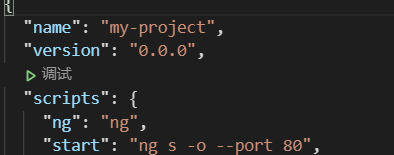
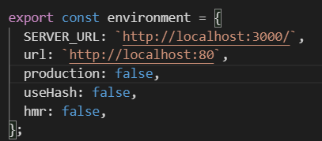
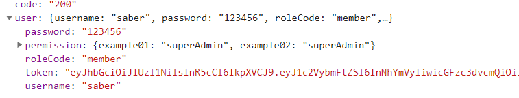
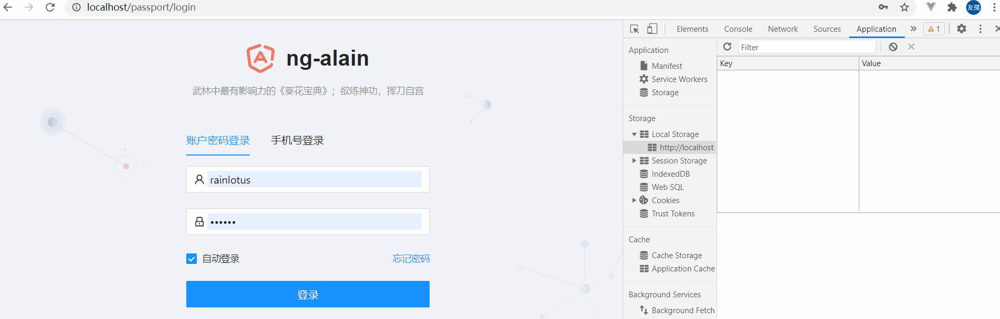
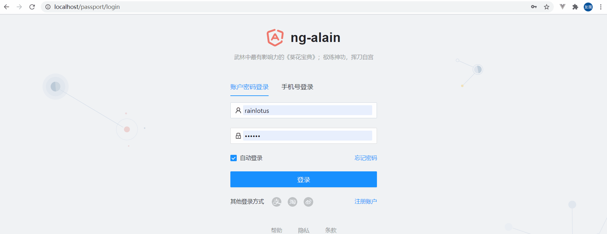
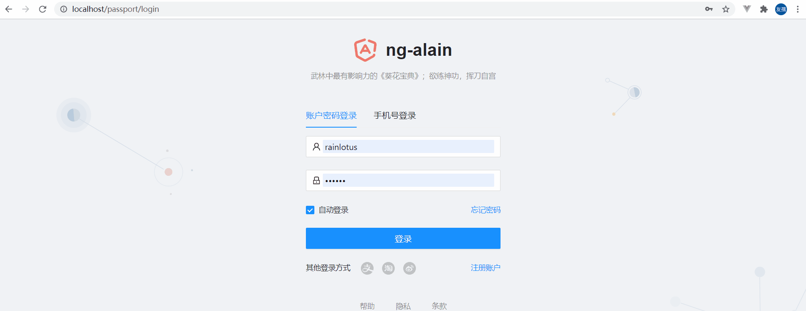
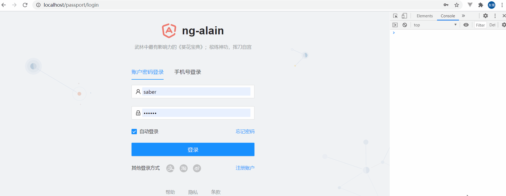
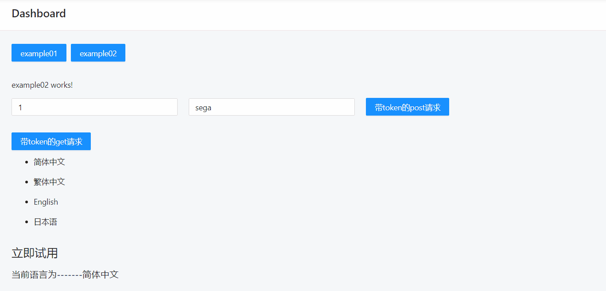

# 一、NG-ALAIN安装

## 1.介绍

**NG-ALAIN 是一个企业级中后台前端/设计解决方案脚手架，秉承 [Ant Design](https://ant.design/) 的设计价值观，目标也非常简单，希望在Angular上面开发企业后台更简单、更快速。它内嵌了[NG-ZORRO](https://ng.ant.design/)的组件库，用户体验较为完整。**

## 2.安装

- ### 全局 Angular Cli

  ```js
  npm install -g @angular/cli
  ```

- ### 创建Angular项目

  ```js
  ng new my-project --style less --routing
  ```

- ### 添加NG-ALAIN

  ```js
  ng add ng-alain@10.x // 本人的angular/cli脚手架版本是10，ng-alain的安装需要和脚手架版本一致才行
  ```

以上皆顺利进行后，来到package.json文件下，小做一点点修改：

1.将**scripts**下的**start**的"ng s -o" 改成 "ng s -o --port 80" (指定端口号是为了避免端口号占用，80端口号的好处，在网页上显示时会省略端口，仅个人喜好。其他端口号亦可，注意避免端口相同即可)



2.配置请求的URL环境

在src/environments/environment.ts下修改如下，其中**SERVER_URL**为向后端请求的地址，**url**为本地项目启动地址，记得带上端口号。



3.创建服务文件

在src/app下创建目录service和文件services.module.ts以便项目整体使用，文件内容如下：

```ts
import { NgModule } from '@angular/core';
import { environment } from './../environments/environment';


@NgModule({
    declarations: [],
    imports: [
    ]
})
export class ServicesModule {
    public static getBackendUrl(): string {
        return environment.SERVER_URL;
    }
}
```

# 二、路由拦截与权限管理

## 1.准备工作

一说到登录这块，不可避免的就会涉及到路由拦截、设置token和权限管理等功能。

首先，为了模拟较为真实的登录环境，我们肯定需要个后台配合，后台仓库地址会在最后奉上，在这里不多做赘述。

只想提两点，

(1).我的登录接口的返回例子如下，接下来有用的就是roleCode、token以及permission这三个属性。



(2).个人原因密码没有做加密操作(懒!)，有兴趣的请自行处理。

## 2.登录

简单改造一下登录页面的逻辑：

### 1）html部分

#### 1.1）文案提示修改

在src/app/routes/passport/login下的login.component.html中，将账号密码的提示文案修改一下

```html
<!-- 第3行到19行 -->
<nz-tab [nzTitle]="'账户密码登录'">
    <nz-alert *ngIf="error" [nzType]="'error'" [nzMessage]="error" [nzShowIcon]="true" class="mb-lg"></nz-alert>
    <nz-form-item>
        <nz-form-control nzErrorTip="Please enter mobile number, muse be: admin or user">
            <nz-input-group nzSize="large" nzPrefixIcon="user">
                <input nz-input formControlName="userName" placeholder="username: rainlotus | saber " />
            </nz-input-group>
        </nz-form-control>
    </nz-form-item>
    <nz-form-item>
        <nz-form-control nzErrorTip="Please enter password, muse be: ng-alain.com">
            <nz-input-group nzSize="large" nzPrefixIcon="lock">
                <input nz-input type="password" formControlName="password" placeholder="password: 123456" />
            </nz-input-group>
        </nz-form-control>
    </nz-form-item>
</nz-tab>
```

#### 1.2）新建路由

1. 来到src/app/routes下右键"在集成终端中打开"，新建两个组件example01和example02

   ```js
   ng g c example01
   ng g c example02
   ```

2. 在routes-routing.module.ts中修改路由配置

   ```ts
   import { Example01Component } from './example01/example01.component';
   import { Example02Component } from './example02/example02.component';
   {
       path: 'dashboard',
           component: DashboardComponent,
               data: { title: '仪表盘', titleI18n: 'dashboard' },
                   children: [
                       {
                           path: 'example01',
                           component: Example01Component,
                       },
                       {
                           path: 'example02',
                           component: Example02Component,
                       },
                   ]
   },
   ```

3. 在src/app/routes/dashboard/dashboard.component.html简单修改一下

   ```html
   <page-header></page-header>
   <button nz-button nzType="primary" [routerLink]="['/dashboard/example01']">example01</button>
   <button nz-button nzType="primary" [routerLink]="['/dashboard/example02']">example02</button>
   <router-outlet></router-outlet>
   ```

### 2）ts部分

#### 2.1）创建一个jwt的泛型接口

在src/app/core下创建一个文件夹名为entity，文件名称为myJwtModel.ts，内容如下：

```ts
import { JWTTokenModel } from '@delon/auth';

export class MyJwtModel extends JWTTokenModel {
  nickname: string;   // 用户昵称
  permissions: any;   // 权限对象
}
```

#### 2.2）登录请求

在login.component.ts中的新添及修改内容如下：

```ts
import { MyJwtModel } from 'src/app/core/entity/myJwtModel';  // 将上面新建的文件引入

// 对constructi中的表单控制条件修改一下
this.form = fb.group({
    userName: [null, [Validators.required, Validators.pattern(/^(rainlotus|saber)$/)]],
    password: [null, [Validators.required, Validators.pattern(/^(123456)$/)]],
    mobile: [null, [Validators.required, Validators.pattern(/^1\d{10}$/)]],
    captcha: [null, [Validators.required]],
    remember: [true],
});

// submit函数整体代码如下：
submit(): void {
    this.error = '';
    if (this.type === 0) {
        this.userName.markAsDirty();
        this.userName.updateValueAndValidity();
        this.password.markAsDirty();
        this.password.updateValueAndValidity();
        if (this.userName.invalid || this.password.invalid) {
            return;
        }
    } else {
        this.mobile.markAsDirty();
        this.mobile.updateValueAndValidity();
        this.captcha.markAsDirty();
        this.captcha.updateValueAndValidity();
        if (this.mobile.invalid || this.captcha.invalid) {
            return;
        }
    }
    // 默认配置中对所有HTTP请求都会强制 [校验](https://ng-alain.com/auth/getting-started) 用户 Token
    // 然一般来说登录请求不需要校验，因此可以在请求URL加上：`/login?_allow_anonymous=true` 表示不触发用户 Token 校验
    (this.http
     .post(ServicesModule.getBackendUrl() + 'passport/login?_allow_anonymous=true', {
        username: this.userName.value,
        password: this.password.value,
    }) as any)     // 类型推导，否则本地有ts-lint校验标黄，看着难受
        .subscribe((res) => {
        if (res.code !== '200') {
            this.error = res.msg;
            return;
        }
        // 清空路由复用信息
        this.reuseTabService.clear();
        // 设置用户Token信息
        const myJwtModel = new MyJwtModel();  // 引入上面的接口
        myJwtModel.nickname = res.user.username;  // 将名称赋给nickname
        myJwtModel.user = res.user;               // 新添user属性
        myJwtModel.token = res.user.token;        // 拿到token
        myJwtModel.permissions = res.user.permission;   // 获得权限对象

        this.tokenService.set(myJwtModel);    // 设置到token服务中

        // 重新获取 StartupService 内容，我们始终认为应用信息一般都会受当前用户授权范围而影响
        this.startupSrv.load().then(() => {
            console.log(myJwtModel.user.roleCode);
            setTimeout(() => {
                // 代码仅为展示不同权限下配置的不同情况，本人偷懒，将其中内容写成一样而已
                // 这里主要为了演示，不同权限下默认页面跳转的不同

                // 管理员
                if (myJwtModel.user.roleCode === 'superAdmin') {   
                    const permission = myJwtModel.user.permission;
                    const roles = [];
                    for (const i in permission) {
                        if (i) {
                            roles.push(i);
                        }
                    }
                    // 这里menuList的对象与res.user.permission的内容一致，这就是接下来权限控制的重要一环
                    const menuList = ['example01', 'example02'];  
                    const urlList = [   // 这里是模拟左侧导航栏有的路由情况（因为偷懒没写在左侧导航里！）
                        '/dashboard/example01',
                        '/dashboard/example02',
                    ];
                    let url = 'dashboard';  // 默认跳转的页面
                    // 如果permissions中没有index权限，则从urlList中找第一个默认路由跳转，反之则跳过
                    if (roles.indexOf('index') === -1) {
                        for (let i = 0; i < menuList.length; i++) {
                            if (roles.indexOf(menuList[i]) !== -1) {
                                url = urlList[i];
                                break;
                            }
                        }
                    }
                    // 路由跳转
                    this.router.navigateByUrl(url);
                    return;
                }
                // 下方的普通用户其实权限就没有index，但为了可拓展性考虑没有和上面共用(虽然代码一样)
                // 普通用户
                if (myJwtModel.user.roleCode === 'member') {
                    const permission = myJwtModel.user.permission;
                    const roles = [];
                    for (const i in permission) {
                        if (i) {
                            roles.push(i);
                        }
                    }
                    const menuList = ['example01', 'example02'];
                    const urlList = [
                        '/dashboard/example01',
                        '/dashboard/example02',
                    ];
                    let url = 'dashboard';
                    // 如果没有index权限，则从urlList中找第一个默认，反之则跳过
                    if (roles.indexOf('index') === -1) {
                        for (let i = 0; i < menuList.length; i++) {
                            if (roles.indexOf(menuList[i]) !== -1) {
                                url = urlList[i];
                                break;
                            }
                        }
                    }
                    this.router.navigateByUrl(url);
                    return;
                }
            }, 300);
        });
    });
```

### 3）退出登录

这块没有改的，但是一套流程还是要走一遍的！

在src/app/layout/default/header/components/user.component.ts中，代码如下：

```ts
import { ChangeDetectionStrategy, Component, Inject } from '@angular/core';
import { Router } from '@angular/router';
import { DA_SERVICE_TOKEN, ITokenService } from '@delon/auth';

constructor(
    private settings: SettingsService, 
    private router: Router, 
    @Inject(DA_SERVICE_TOKEN) private tokenService: ITokenService
) {}

logout(): void {
    this.tokenService.clear();
    this.router.navigateByUrl(this.tokenService.login_url!);
}
```

### 4）实际登录效果图



## 3.权限控制

### 1）介绍

ACL 全称叫访问控制列表（Access Control List），是一种非常简单的基于角色权限控制方式。一个完全独立 `@delon/acl` 模块。

### 2）粒度控制

来到src/app/core/startup/startup.service.ts文件，代码修改如下：

```ts
// 以下代码仅为当前需求的必要代码，其余没有展示

import { ACLService } from '@delon/acl';
import { DA_SERVICE_TOKEN, ITokenService } from '@delon/auth';

constructor(
    private aclService: ACLService,    
    @Inject(DA_SERVICE_TOKEN) private tokenService: ITokenService,
    ) {
    }
private viaMock(resolve: any, reject: any): any {
	// 因为我用的是jwt所以要使用this.tokenService.get(MyJwtModel)，否则为this.tokenService.get()
    const ACLS = this.tokenService.get(MyJwtModel).user;
    if (ACLS) {
        const role = ACLS.roleCode;
        this.aclService.setRole([role]);  // 设置用户身份
    }

    // 下方为mock数据，真实开发中会选择viaHttp方法，所以没有特别必要
   	// 必要说明一下，下方this.aclService.setFull(true);需要注释掉或者设为false，否则页面的权限控制肯   	// 定会失效
    const app: any = {
        name: `ng-alain`,
        description: `Ng-zorro admin panel front-end framework`
    };
    const user: any = {
        name: 'Admin',
        avatar: './assets/tmp/img/avatar.jpg',
        email: 'cipchk@qq.com',
        token: '123456789'
    };
    // Application information: including site name, description, year
    this.settingService.setApp(app);
    // User information: including name, avatar, email address
    this.settingService.setUser(user);
    // ACL: Set the permissions to full, https://ng-alain.com/acl/getting-started
    // this.aclService.setFull(true);
    // Menu data, https://ng-alain.com/theme/menu
    this.menuService.add([
        {
            text: 'Main',
            group: true,
            children: [
                {
                    text: 'Dashboard',
                    link: '/dashboard',
                    icon: { type: 'icon', value: 'appstore' }
                },
                {
                    text: 'Quick Menu',
                    icon: { type: 'icon', value: 'rocket' },
                    shortcutRoot: true
                }
            ]
        }
    ]);
    // Can be set page suffix title, https://ng-alain.com/theme/title
    this.titleService.suffix = app.name;

    resolve({});
}
```

在example01.component.ts中代码如下：

```ts
import { Component, Inject, Injector, OnInit } from '@angular/core';
import { ACLService } from '@delon/acl';
import { DA_SERVICE_TOKEN, ITokenService } from '@delon/auth';
import { MyJwtModel } from 'src/app/core/entity/myJwtModel';
@Component({
    selector: 'app-example01',
    templateUrl: './example01.component.html',
    styles: [
    ]
})
export class Example01Component implements OnInit {

    constructor(
    private injector: Injector,
     private aclservice: ACLService,
     @Inject(DA_SERVICE_TOKEN) private tokenService: ITokenService
    ) { }

ngOnInit(): void {
    // 加载权限配置
    // this.tokenService.get(MyJwtModel)获取jwt格式的token
    // this.injector.get(DA_SERVICE_TOKEN) as ITokenService 与上方获取jwt的方法本质是一样的
    console.log(this.tokenService.get(MyJwtModel).user);

    // const ACLS = (this.injector.get(DA_SERVICE_TOKEN) as ITokenService).get(MyJwtModel).user;
    const ACLS = this.tokenService.get(MyJwtModel).user;
    const aclPermission = ACLS.permission;   // 权益对象
    const arr = Object.keys(aclPermission);  // 权益对象数组
    // 注意attachRole不会先清除所有，如果我不在startup.service.ts中使用setRole，切换账号后会出现权限	     // 没生效的问题，可能得需要刷新页面才会生效
    this.aclservice.attachRole(arr);         // 为用户添加权限
}

}
```

在example01.component.html中代码如下：

```html
<h1 style="margin-top: 30px;">权限管理测试</h1>
<h3>以下会有四个按钮分别为：example01、example02、index、xxx</h3>
<button nz-button nzType="primary">example01</button>
<button nz-button nzType="primary">example02</button>
<button nz-button nzType="primary">index</button>
<button nz-button nzType="primary">xxx</button>
<h3 style="margin-top: 10px;">其中前三个后端返回的permission中实际就有的，index这个权限会根据账号不同显示或者隐藏，而xxx就是随便编的用做衬托</h3>
<h1>以下就是带上权限后的页面</h1>
<button nz-button nzType="primary" [acl]="['example01','superAdmin']">example01</button>
<button nz-button nzType="primary" [acl]="'example02'">example02</button>
<button nz-button nzType="primary" [acl]="'index'">index</button>
<button nz-button nzType="primary" [acl]="'xxx'">xxx</button>
```

页面效果图如下：



### 3）路由守卫

来到路由配置文件，在此以routes-routing.module.ts举例：

```ts
import { ACLGuard } from '@delon/acl';
{
    path: 'dashboard',
        component: DashboardComponent,
            canActivate: [ACLGuard],  //此处配置路由守卫
                //guard: 'superAdmin'则是只允许superAdmin身份的账号登录
                data: { title: '仪表盘', titleI18n: 'dashboard', guard: 'superAdmin' },
                    children: [
                        {
                            path: 'example01',
                            component: Example01Component,
                        },
                        {
                            path: 'example02',
                            component: Example02Component,
                        },
                    ]
},
```

页面效果图如下：



## 4.路由拦截

#### 1）请求统一配置

在此只是做了统一的加上服务端前缀，请求头添加token处理。

在src/app/core/net/default.interceptor.ts中修改：

```ts
constructor(
    private injector: Injector,
    @Inject(DA_SERVICE_TOKEN) private tokenService: ITokenService,
    ) { }
intercept(req: HttpRequest<any>, next: HttpHandler): Observable<HttpEvent<any>> {
    // 统一加上服务端前缀
    const jwtModel = this.tokenService.get(JWTTokenModel);

    let url = req.url;
    if (!url.startsWith('https://') && !url.startsWith('http://')) {
    url = environment.SERVER_URL + url;
}

let newReq = req.clone({ url });
// 当token存在时，为所有请求设置请求头
if (jwtModel.token) {
    newReq = req.clone({
        url, setHeaders: {
            Authorization: `Bearer ${jwtModel.token}`
        },
    });
}
return next.handle(newReq).pipe(
    mergeMap((ev) => {
        // 允许统一对请求错误处理
        if (ev instanceof HttpResponseBase) {
            return this.handleData(ev, newReq, next);
        }
        // 若一切都正常，则后续操作
        return of(ev);
    }),
    catchError((err: HttpErrorResponse) => this.handleData(err, newReq, next)),
);
}
```

ps:官方原生的代码有问题，即NzNotificationService服务说没有引用，所以遇到这样情况，只需来到app.module.ts中引入即可。

```ts
import { NzNotificationService } from 'ng-zorro-antd/notification';
providers: [
    NzNotificationService,
],
```

#### 2）路由设置

将SimpleGuard改为JWTGuard，并引入即可，目的是为了请求时token过期，会自动导向到登录界面

```ts
import { JWTGuard } from '@delon/auth'; 
{
    path: '',
        component: LayoutDefaultComponent,
            canActivate: [JWTGuard],    // 这样一旦token过期变会直接退出到登录页面
                children: [
                    { path: '', redirectTo: 'dashboard', pathMatch: 'full' },
                    {
                        path: 'dashboard',
                        component: DashboardComponent,
                        // canActivate: [ACLGuard],
                        data: { title: '仪表盘', titleI18n: 'dashboard', guard: 'superAdmin' },
                        children: [
                            {
                                path: 'example01',
                                component: Example01Component,
                            },
                            {
                                path: 'example02',
                                component: Example02Component,
                            },
                        ]
                    },
                ]
}
```

#### 3）请求实例演示

##### 3.1）HTML部分

在src/app/routes/example02/example02.component.html中，修改如下：

```html
<p style="margin-top: 30px;">example02 works!</p>
<input nz-input style="width: 300px;margin-right: 20px;" type="tel" name="" id="" [(ngModel)]="telNUm"
placeholder="数字：1">
<input nz-input style="width: 300px;margin-right: 20px;" type="text" [(ngModel)]="nickName" placeholder="名称：sega">
<button nz-button nzType="primary" (click)="getInfo()">带token的post请求</button>
<div style="margin-top: 10px;">
<div *ngIf="dataList"> 
<span style="margin-right: 10px;">name</span>
<span>address</span>
</div>
<div *ngFor="let item of dataList">
<span style="margin-right: 10px;">{{item.name}}</span>
<span>{{item.address}}</span>
</div>
</div>

<button style="margin-top: 20px;" nz-button nzType="primary" (click)="getData()">带token的get请求</button>
<div style="margin-top: 10px;">
<div *ngIf="dataList"> 
<span style="margin-right: 10px;">name</span>
<span>address</span>
</div>
<div *ngFor="let item of orderList">
<span style="margin-right: 10px;">{{item.orderId}}</span>
<span>{{item.address}}</span>
</div>
</div>
```

##### 3.2）封装请求服务

在service文件夹下，创建一个服务，命令为：

```js
ng g s example02
```

服务代码内容如下，仅供参考：

```ts
import { HttpClient } from '@angular/common/http';
import { Injectable } from '@angular/core';
import { Observable, Subject } from 'rxjs';
import { ServicesModule } from './services.module';
@Injectable({
providedIn: 'root'
})
export class Example02Service {

constructor(private httpClient: HttpClient) { }

private COMB_URL = ServicesModule.getBackendUrl();

// example02请求 
private EXAMPLE_URL = this.COMB_URL + 'passport/address';

private ORDER_URL = this.COMB_URL + 'passport/order';

// example02 post请求方法
postExample02Data(param: any): any {
return this.httpClient.post(this.EXAMPLE_URL, param);
}

// example02 get请求方法
getExample02Data(): any {
return this.httpClient.get(this.ORDER_URL);
}
}
```

##### 3.3）ts部分

```ts
import { Component, OnInit } from '@angular/core';
import { Example02Service } from 'src/app/service/example02.service';
interface DataListType {
    name: string;
    address: string;
}
interface OrderDataType {
    orderId: string;
    address: string;
}

@Component({
    selector: 'app-example02',
    templateUrl: './example02.component.html',
    styles: [
    ]
})

export class Example02Component implements OnInit {
    telNUm = 1;
    nickName = 'sega';
    dataList;
    orderList;
    constructor(
    private example02: Example02Service
    ) { }

    ngOnInit(): void {
    }

    getInfo(): void {
        const params = {
            id: Number(this.telNUm),
            name: this.nickName
        };
        this.example02.postExample02Data(params).subscribe(res => {
            this.dataList = res.data as DataListType;
        });
    }

    getData(): void {
        this.example02.getExample02Data().subscribe(res => {
            this.orderList = res.data as OrderDataType;
        });

    }
}
```

##### 3.4）效果演示



# 三、国际化

Angular 国际化常见有 Angular 内置和基于 @ngx-translate/core （请参考[官网](https://github.com/ngx-translate/core)了解更多实现细节）两种不同国际化方案。而[@ngx-translate/core](https://github.com/ngx-translate/core) 是社区版本的 Angular 国际化，相比较 Angular 内置它是动态性，无须针对不同语言构建和部署单独版本，并且大部分情况下可以立即呈现。

以下便是@ngx-translate/core的配置过程：

### 1）准备工作

#### 1.1）安装插件

```js
// 安装ngx-translate插件配置国际化
npm i @ngx-translate/core --save
npm i @ngx-translate/http-loader --save

// 如果其中一个装包失败，请将package-lock.json删除，然后npm i装包，最后将装包失败的命令重新装一下就可以成功了
```

#### 1.2）创建服务文件

在src/app/core文件夹下创建一个名为i18n的文件夹，以及旗下文件i18n.service.ts。

ps:之所以在这儿配置，其一ng-alian的github源码就是这么配置的；其二也是因为这种文件虽然属于服务一块，但同时它本身就属于项目一启动，全局配置使用的文件，放在这儿显然更好。当然，放在哪里还是你的自由。

i18n.service.ts的代码内容如下：

```ts
// 以下内容基本上是从源码那里复制过来的
import { Platform } from '@angular/cdk/platform';
import { registerLocaleData } from '@angular/common';
import ngEn from '@angular/common/locales/en';
import ngZh from '@angular/common/locales/zh';
import ngZhTw from '@angular/common/locales/zh-Hant';
import ngJa from '@angular/common/locales/ja';
import { Injectable } from '@angular/core';
import {
    AlainI18NService,
    DelonLocaleService,
    en_US as delonEnUS,
    SettingsService,
    zh_CN as delonZhCn,
    zh_TW as delonZhTw,
} from '@delon/theme';
import { TranslateService } from '@ngx-translate/core';
import { enUS as dfEn, zhCN as dfZhCn, zhTW as dfZhTw, ja as dfJaJp } from 'date-fns/locale';
import { NzSafeAny } from 'ng-zorro-antd/core/types';
import { en_US as zorroEnUS, ja_JP as zorroJaJp, NzI18nService, zh_CN as zorroZhCN, zh_TW as zorroZhTW } from 'ng-zorro-antd/i18n';
import { BehaviorSubject, Observable } from 'rxjs';
import { filter } from 'rxjs/operators';
interface LangData {
    abbr: string;
    text: string;
    ng: NzSafeAny;
    zorro: NzSafeAny;
    date: NzSafeAny;
    delon: NzSafeAny;
    // 服务端对应的语言值
    // backendKey: string;
}

const DEFAULT = 'zh-CN';
const LANGS: { [key: string]: LangData } = {
    // 每添加一门语言，在这里添加即可，当然与此同时需要添加一份专门的的json文件
    'zh-CN': {
        text: '简体中文',
        ng: ngZh,
        zorro: zorroZhCN, // 重命名
        date: dfZhCn,
        delon: delonZhCn,
        abbr: '🇨🇳',
    },
    'zh-TW': {
        text: '繁体中文',
        ng: ngZhTw,
        zorro: zorroZhTW, // 重命名
        date: dfZhTw,
        delon: delonZhTw,
        abbr: '🇭🇰',
    },
    'en-US': {
        text: 'English',
        ng: ngEn,
        zorro: zorroEnUS, // 重命名
        date: dfEn,
        delon: delonEnUS,
        abbr: '🇺🇸',
    },
    'ja-JP': {
        text: '日本语',
        ng: ngJa,
        zorro: zorroJaJp, // 重命名
        date: dfJaJp,
        delon: delonZhCn,
        abbr: '🇯🇵',
    },
};

@Injectable({ providedIn: 'root' })
export class I18NService implements AlainI18NService {
    private _default = DEFAULT;
    private change$ = new BehaviorSubject<string | null>(null);

    private _langs = Object.keys(LANGS).map((code) => {
        const item = LANGS[code];
        return { code, text: item.text, abbr: item.abbr };
    });

    constructor(
    private settings: SettingsService,
     private nzI18nService: NzI18nService,
     private delonLocaleService: DelonLocaleService,
     private translate: TranslateService,
     private platform: Platform,
    ) {
        // `@ngx-translate/core` 预先知道支持哪些语言
        const lans = this._langs.map((item) => item.code);
        translate.addLangs(lans);

        const defaultLan = this.getDefaultLang();
        if (lans.includes(defaultLan)) {
            this._default = defaultLan;
        }

        this.updateLangData(this._default);
    }

    private getDefaultLang(): string {
        if (!this.platform.isBrowser) {
            return DEFAULT;
        }
        if (this.settings.layout.lang) {
            return this.settings.layout.lang;
        }
        return (navigator.languages ? navigator.languages[0] : null) || navigator.language;
    }

    private updateLangData(lang: string): void {
        const item = LANGS[lang];
        registerLocaleData(item.ng);
        this.nzI18nService.setLocale(item.zorro);
        this.nzI18nService.setDateLocale(item.date);
        this.delonLocaleService.setLocale(item.delon);
    }

    get change(): Observable<string> {
        return this.change$.asObservable().pipe(filter((w) => w != null)) as Observable<string>;
    }

    use(lang: string): void {
        lang = lang || this.translate.getDefaultLang();
        if (this.currentLang === lang) {
            return;
        }
        this.updateLangData(lang);
        (this.translate.use(lang) as any).subscribe(() => this.change$.next(lang));
    }
    /** 获取语言列表 */
    getLangs(): Array<{ code: string; text: string; abbr: string }> {
        return this._langs;
    }
    /** 翻译 */
    fanyi(key: string, interpolateParams?: {}): any {
        return this.translate.instant(key, interpolateParams);
    }
    /** 默认语言 */
    get defaultLang(): string {
        return this._default;
    }
    /** 当前语言 */
    get currentLang(): string {
        return this.translate.currentLang || this.translate.getDefaultLang() || this._default;
    }
}
```

#### 1.3）语言文件

在assets文件夹下，添加i18n文件夹，因为上述服务文件共配置了四种语言，因此，这里我们也添加了四个json文件，名称与上述服务文件中**LANGS**变量的属性名一致，即"en-US.json","ja-JP.json","zh-CN.json","zh-TW.json"

```json
// zh-CN
{
    "GENERAL.I18N.CHINESE": "简体中文",
    "GENERAL.I18N.PRO.APPLY": "立即试用",
    "GENERAL.I18N.NUM": "数字是{{num}}个"
}
```

```json
// zh-TW
{
    "GENERAL.I18N.CHINESE": "簡體中文",
    "GENERAL.I18N.PRO.APPLY": "立即試用",
    "GENERAL.I18N.NUM": "數字是{{num}}個"
}
```

```json
// en-US
{
    "GENERAL.I18N.CHINESE": "English",
    "GENERAL.I18N.PRO.APPLY": "Try now",
    "GENERAL.I18N.NUM": "The Num is {{num}}"
}
```

```json
// ja-JP
{
    "GENERAL.I18N.CHINESE": "日本语",
    "GENERAL.I18N.PRO.APPLY": "すぐに試用する",
    "GENERAL.I18N.NUM": "数字は{{num}}つあります"
}
```

### 2）国际化配置

#### 2.1）app.module.ts

```ts
// 配置国际化翻译文件
import { ALAIN_I18N_TOKEN } from '@delon/theme';
import { TranslateLoader, TranslateModule } from '@ngx-translate/core';
import { TranslateHttpLoader } from '@ngx-translate/http-loader';
import { I18NService } from '../app/core/i18n/i18n.service';
// 动态加载i18n语言文件
export function I18nHttpLoaderFactory(http: HttpClient): any {
    return new TranslateHttpLoader(http, `assets/i18n/`, '.json');
}
// 注入的模块
const I18NSERVICE_MODULES = [
    TranslateModule.forRoot({
        loader: {
            provide: TranslateLoader, 
            useFactory: I18nHttpLoaderFactory, // 使用I18nHttpLoaderFactory来加载文件
            deps: [HttpClient],
        },
    }),
];
const I18NSERVICE_PROVIDES = [{ provide: ALAIN_I18N_TOKEN, useClass: I18NService, multi: false }];

// 以下省略了无关模块的引入
@NgModule({
    imports: [
        ...I18NSERVICE_MODULES,
    ],
    providers: [
        ...I18NSERVICE_PROVIDES,
    ],
})
```

ps:`@delon/*` 类库有许多带有 *i18n* 字样的数据接口属性（例如：`page-header`、`st` 列描述、`Menu` 菜单数据等等），当你希望这些组件的数据接口能动态根据 Key 值按当前语言自动切换时，你还需要对 `ALAIN_I18N_TOKEN` 定义一个自实现服务接口（例如：[I18NService](https://github.com/ng-alain/ng-alain/blob/master/src/app/core/i18n/i18n.service.ts)），并在根模块下注册。

#### 2.2）请求拦截修改

在src/app/core/net/default.interceptor.ts下对**intercept**方法做进一步的拦截修改，完整代码如下：

```ts
intercept(req: HttpRequest<any>, next: HttpHandler): Observable<HttpEvent<any>> {
// 统一加上服务端前缀
const jwtModel = this.tokenService.get<JWTTokenModel>(JWTTokenModel);
let url = req.url;
if (url.indexOf('assets') !== -1) {   // 为了国际化调取json文件准备的 
url = url;
} else {
if (!url.startsWith('https://') && !url.startsWith('http://')) {
url = environment.SERVER_URL + url;
}
}

let newReq = req.clone({ url });
if (jwtModel.token) {
newReq = req.clone({
url, setHeaders: {
Authorization: `Bearer ${jwtModel.token}`
},
});
}
return next.handle(newReq).pipe(
mergeMap((ev) => {
// 允许统一对请求错误处理
if (ev instanceof HttpResponseBase) { return this.handleData(ev, newReq, next); }
// 若一切都正常，则后续操作
return of(ev);
}),
catchError((err: HttpErrorResponse) => this.handleData(err, newReq, next)),
);
}
```

#### 2.3）startup.service.ts

```ts
import { HttpClient } from '@angular/common/http';
import { Inject, Injectable, Injector } from '@angular/core';
import { Router } from '@angular/router';
import { ACLService } from '@delon/acl';
import { DA_SERVICE_TOKEN, ITokenService } from '@delon/auth';
import { ALAIN_I18N_TOKEN, MenuService, SettingsService, TitleService } from '@delon/theme';
import { zip } from 'rxjs';
import { catchError } from 'rxjs/operators';

import { TranslateService } from '@ngx-translate/core';
import { NzIconService } from 'ng-zorro-antd/icon';
import { ICONS } from '../../../style-icons';
import { ICONS_AUTO } from '../../../style-icons-auto';
import { MyJwtModel } from '../entity/myJwtModel';
import { I18NService } from '../i18n/i18n.service';
constructor(
    iconSrv: NzIconService,
    private menuService: MenuService,
    private settingService: SettingsService,
    private aclService: ACLService,
    private titleService: TitleService,
    @Inject(DA_SERVICE_TOKEN) private tokenService: ITokenService,
    private httpClient: HttpClient,
    private injector: Injector,
    private translate: TranslateService,
    @Inject(ALAIN_I18N_TOKEN) private i18n: I18NService,
    ) {
         iconSrv.addIcon(...ICONS_AUTO, ...ICONS);
      }

private viaMock(resolve: any, reject: any): any {
    // 这是之前配置的用户权限代码
    const ACLS = this.tokenService.get(MyJwtModel).user;
    if (ACLS) {
        const role = ACLS.roleCode;
        this.aclService.setRole([role]);  // 设置用户身份
    }

    // 刚启动时，根据当前语言环境请求对应的json文件
    let language = 'zh-CN';
    let lang = '简体中文';
    if (!this.settingService.layout.lang) {
        if (navigator.language.startsWith('zh')) {
            language = 'zh-CN';
            lang = '简体中文';
        } else if (navigator.language.startsWith('en')) {
            language = 'en-US';
            lang = 'English';
        } else {
            language = 'zh-CN';
            lang = '简体中文';
        }
    } else {
        language = this.settingService.layout.lang;
    }
	
    (this.httpClient.get(`assets/i18n/${language}.json?nocache=${new Date().getTime()}`) as any) // 类型推导 要不然subscribe订阅方法会警告
        .subscribe(langData => {
        // 只要启动应用, 就无条件加载翻译文件
        // setting language data
        this.translate.setTranslation(language, langData);
        this.translate.setDefaultLang(language);
        this.i18n.use(language);
        this.settingService.setLayout('lang', language);
        resolve({});
    });

    // 在真实环境下，以下代码没用
    // mock
    const app: any = {
        name: `ng-alain`,
        description: `Ng-zorro admin panel front-end framework`
    };
    const user: any = {
        name: 'Admin',
        avatar: './assets/tmp/img/avatar.jpg',
        email: 'cipchk@qq.com',
        token: '123456789'
    };
    // Application information: including site name, description, year
    this.settingService.setApp(app);
    // User information: including name, avatar, email address
    this.settingService.setUser(user);
    // ACL: Set the permissions to full, https://ng-alain.com/acl/getting-started
    // this.aclService.setFull(false);
    // Menu data, https://ng-alain.com/theme/menu
    this.menuService.add([
        {
            text: 'Main',
            group: true,
            children: [
                {
                    text: 'Dashboard',
                    link: '/dashboard',
                    icon: { type: 'icon', value: 'appstore' }
                },
                {
                    text: 'Quick Menu',
                    icon: { type: 'icon', value: 'rocket' },
                    shortcutRoot: true
                }
            ]
        }
    ]);
    // Can be set page suffix title, https://ng-alain.com/theme/title
    this.titleService.suffix = app.name;

    resolve({});
}
```

#### 2.4）shared.module.ts

```ts
import { TranslateModule } from '@ngx-translate/core';   // 页面上可以使用translate管道
@NgModule({
    exports: [
        TranslateModule,
    ]
})
```

### 3）页面引用

以下为偷懒写法：

在src/app/routes/example02/example02.component.html中添加：

```html
<ul>
    <li *ngFor="let item of langs" (click)="change(item.code)" style="width: 120px;height: 36px;cursor: pointer;">
        {{ item.text }}
    </li>
</ul>
<h1>{{'GENERAL.I18N.PRO.APPLY'|translate}}</h1>
<h3>当前语言为-------{{'GENERAL.I18N.CHINESE'|translate}} </h3>
```

在login.component.ts中添加代码如下：

```ts
import { Component, Inject, OnInit } from '@angular/core';
import { ALAIN_I18N_TOKEN, SettingsService } from '@delon/theme';
import { I18NService } from 'src/app/core/i18n/i18n.service'; 

get langs(): any {
return this.i18n.getLangs();
}

constructor(
@Inject(ALAIN_I18N_TOKEN) private i18n: I18NService,
private settings: SettingsService
) {}

change(lang: string): void {
this.i18n.use(lang);
this.settings.setLayout('lang', lang);
const currentLang = this.i18n.currentLang; // 获取当前语言
console.log(currentLang);
}
```

### 4）效果演示

