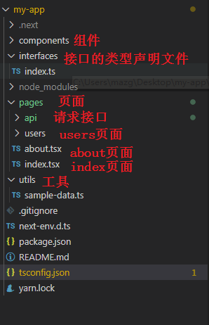
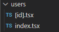

## 1.Next.Js介绍

### 1.1 next.js是什么

next.js作为一款轻量级的应用框架，主要用于构建静态网站和后端渲染网站。

> Next.js 只支持[React 16](https://reactjs.org/blog/2017/09/26/react-v16.0.html).
> 由于我们使用 React 16 的特性，所以不得不放弃对 React 15 以及以下版本的支持. 当前译版为7.0.0-canary.8

### 1.2 框架特点

- 使用后端渲染
- 自动进行代码分割（code splitting），以获得更快的网页加载速度
- 简洁的前端路由实现
- 使用webpack进行构建，支持模块热更新（Hot Module Replacement）
- 可与主流Node服务器进行对接（如express）
- 可自定义babel和webpack的配置


## 2.Next项目创建

### 2.1 安装create-next-app脚手架

https://create-next-app.js.org/get-started-with-examples

```javascript
yarn global add create-next-app@9.5.0
create-next-app my-project
// create-next-app my-project --example with-typescript    //需要等比较久
cd my-project
yarn dev
```



### 2.2 添加antd

安装`antd`和按需加载的`babel-plugin-import`。

```javascript
yarn add antd@3.9.2 babel-plugin-import   //ant design和按需加载

yarn add @zeit/next-css @zeit/next-less less   //样式
yarn add babel-plugin-module-resolver    //取别名
yarn add next-compose-plugins   //合并插件
```

跟目录下建立`.babelrc`

```javascript
{
  "presets": ["next/babel"],
  "plugins": [
    // 让我们可以使用根路径，避免相对路径的混乱，如import Head from '@/components/Head'
    [
      "module-resolver",
      {
        "alias": {
          "@": "./"
        }
      }
    ],
    [
      "import",
      {
        "libraryName": "antd",
        "style": "css"
      }
    ]
  ]
}
```

根目录有个`next.config.js`，专门用来修改`next`以及`webpack`的配置。更改如下：

```javascript
/* eslint-disable */
const withCss = require('@zeit/next-css')
const withLess = require('@zeit/next-less')

const withPlugins = require("next-compose-plugins");

const style = [
  [withCss, {

  }],
  [withLess, {

  }],
]

module.exports = withPlugins([...style],{
  distDir: 'dist',
  webpack: (config, { isServer }) => {
    if (isServer) {
      const antStyles = /antd\/.*?\/style\/css.*?/
      const origExternals = [...config.externals]
      config.externals = [
        (context, request, callback) => {
          if (request.match(antStyles)) return callback()
          if (typeof origExternals[0] === 'function') {
            origExternals[0](context, request, callback)
          } else {
            callback()
          }
        },
        ...(typeof origExternals[0] === 'function' ? [] : origExternals),
      ]

      config.module.rules.unshift({
        test: antStyles,
        use: 'null-loader',
      })
    }
    return config
  },
})

```

### 2.3 使用antd组件

```javascript
#pages/index.js

import { Button } from 'antd';
import { Pagination } from 'antd';

const Home = () => (
  <div className="container">
    <Button type="primary">Primary</Button>
    <Pagination defaultCurrent={1} total={50} />
 .........
```

### 2.4 使用less

```javascript
#1. 编写index.less
.title{
  text-align: center;
  font-size: 30px;
}

#2.在pages目录下新建typing.d.ts
declare module 'slash2';
declare module '*.css';
declare module '*.less';
declare module '*.scss';
declare module '*.sass';
declare module '*.svg';
declare module '*.png';
declare module '*.jpg';
declare module '*.jpeg';
declare module '*.gif';
declare module '*.bmp';
declare module '*.tiff';
declare module 'omit.js';

#3.index.tsx中使用less
import './index.less'

#4.给less开启模块化   修改nuxt.config.js
[withLess, {
    cssModules: true
}],
```

## 3.Next基本使用

### 3.1  创建视图

pages目录下新建about.tsx

```js
import Link from 'next/link'
import Layout from '../components/Layout'

const AboutPage = () => (
  <Layout title="About | Next.js + TypeScript Example">
    <h1>About</h1>
    <p>This is the about page</p>
    <p>
      <Link href="/">
        <a>Go home</a>
      </Link>
    </p>
  </Layout>
)

export default AboutPage
```

浏览器访问：<http://localhost:3000/about>

> Next.js 没有路由配置文件，路由的规则跟 PHP 有点像。只要在 pages 文件夹下创建的文件，都会默认生成以文件名命名的路由

### 3.2 页面跳转和路由参数

我们可以使用传统的a标签在页面之间进行跳转，但每跳转一次，都需要去服务端请求一次。为了增加页面的访问速度，推荐使用`next/link`组件进行跳转。将 index.js 改写：

```javascript
import { Button } from 'antd';
import { Pagination } from 'antd';
import Link from 'next/link'

const Home = () => (
  <div className="container">
    <Button type="primary">Primary</Button>
    <Pagination defaultCurrent={1} total={50} />
    <Link href="/about">
      <a>About Page</a>
    </Link>
    .........
```

> **Link标签支持任意react组件作为其子元素，不一定要用a标签，只要该子元素能响应onClick事件**，就像下面这样：

```js
<Link href="/about">
    <div>Go about page</div>
</Link>
```

> **Link标签不支持添加style和className等属性，如果要给链接增加样式，需要在子元素上添加**：

```js
<Link href="/about">
    <a className="about-link" style={{color:'#ff0000'}}>Go about page</a>
</Link>
```

### 3.3 路由传参

如果需要给路由传参数，则使用`query string`的形式，将 index.tsx 改写：

```javascript
import Link from 'next/link'
import Layout from '../components/Layout'
import { Button } from 'antd';
import { Pagination } from 'antd';
import styles from './index.less'
console.log(styles)

const PostLink = (props:any) => (
  <li>
    {/* <Link href={`/about?title=${props.title}`}>
      <a>{props.title}</a>
    </Link> */}

    <Link href={{ pathname: '/about', query: { title: props.title } }}>
      <a>{props.title}</a>
    </Link>
  </li>
);

const IndexPage = () => (
  <Layout title="Home | Next.js + TypeScript Example">
    <h1 className="title">Hello Next.js 👋</h1>
    <Button type="primary" href="">Primary</Button>
    <Pagination defaultCurrent={1} total={50} />
    <Link href="/about?title=hello">
      <a>About Page</a>
    </Link>
 
    <ul>
      <PostLink title="Hello next.js" />
      <PostLink title="next.js is awesome" />
      <PostLink title="Deploy apps with Zeit" />
    </ul>
  </Layout>
)

export default IndexPage
```

取参数的时候，需要借助框架提供的`withRouter`方法，参数封装在 query 对象中，将 about.tsx 改写：

```javascript
import Link from "next/link";
import Layout from "../components/Layout";
import { withRouter } from "next/router";
import { Button } from 'antd';

const AboutPage = (props: any) => {
  var flag = false;
  return <Layout title="About | Next.js + TypeScript Example">
    <h1>{props.router.query.title}</h1>
    这是About页面
    {flag && <Button type="primary" href="">Primary</Button>}
    <Link href="/">
      <a>首页</a>
    </Link>
  </Layout>
};

export default withRouter(AboutPage);

#注意：这边有个bug，当next和antd结合使用的时候，如果某个页面中没有使用到antd组件，那么这个页面不能被刷新，否则路由导航失效，antd的样式也不会被加载
#因此这边在about页面中使用了Button组件，即使Button组件没有被渲染到页面
```

> **如果希望浏览器地址栏不显示query string，可以使用Link标签的as属性：**

```javascript
<Link as="/t/123" href="/about?title=123">
    <a>About Page2</a>
</Link>
```

### 3.4 Layout

所谓的layout就是就是给不同的页面添加相同的header，footer，navbar等通用的部分，同时又不需要写重复的代码。在next.js中可以通过共享某些组件实现layout。

在components目录下创建Layout.tsx

```javascript
import React, { ReactNode } from 'react'
import Link from 'next/link'
import Head from 'next/head'

type Props = {
  children?: ReactNode
  title?: string
}

const Layout = ({ children, title = 'This is the default title' }: Props) => (
  <div>
    <Head>
      <title>{title}</title>
      <meta charSet="utf-8" />
      <meta name="viewport" content="initial-scale=1.0, width=device-width" />
    </Head>
    <header>
      <nav>
        <Link href="/">
          <a>Home</a>
        </Link>{' '}
        |{' '}
        <Link href="/about">
          <a>About</a>
        </Link>{' '}
        |{' '}
        <Link href="/users">
          <a>Users List</a>
        </Link>{' '}
        | <a href="/api/users">Users API</a>
      </nav>
    </header>
    {children}
    <footer>
      <hr />
      <span>I'm here to stay (Footer)</span>
    </footer>
  </div>
)

export default Layout
```

在页面中就可以使用这个Layout布局组件了

```javascript
const IndexPage = () => (
  <Layout title="Home | Next.js + TypeScript Example">
    <h1 className="title">Hello Next.js 👋</h1>
    <Button type="primary" href="">Primary</Button>
    <Pagination defaultCurrent={1} total={50} />
    <Link href="/about?title=hello">
      <a>About Page</a>
    </Link>
 
    <ul>
      <PostLink title="Hello next.js" />
      <PostLink title="next.js is awesome" />
      <PostLink title="Deploy apps with Zeit" />
    </ul>
  </Layout>
)

export default IndexPage
```

### 3.5 动态路由



通过localhost:3000/users/zs   即可访问[id].tsx

通过localhost:3000/users   即可访问index.tsx

## 4.样式加载

对于React应用，有多种方式可以增加样式。主要分为两种： 

1. 使用传统CSS文件（包括SASS，Less等） 
2. 在JS文件中插入CSS

使用传统CSS文件在实际使用中会用到挺多的问题，所以next.js推荐使用第二种方式。next.js内部默认使用[styled-jsx](https://github.com/zeit/styled-jsx)框架向js文件中插入CSS。这种方式引入的样式在不同组件之间不会相互影响，甚至父子组件之间都不会相互影响。

### 4.1  styled-jsx

接下来，我们看一下如何使用styled-jsx。将`about.tsx`的内容替换如下：

```js
import Link from "next/link";
import Layout from "../components/Layout";
import { withRouter } from "next/router";
import { Button } from "antd";

const AboutPage = (props: any) => {
  var flag = false;
  return (
    <Layout title="About | Next.js + TypeScript Example">
      <div className="container">
        <h1>{props.router.query.title}</h1>
        这是About页面
        {flag && (
          <Button type="primary" href="">
            Primary
          </Button>
        )}
        <Link href="/">
          <a>首页</a>
        </Link>
      </div>

      <style jsx>
        {`
          h1 {
            background-color: blue;
            font-size: 60px;
          }
          .container {
            color: red;
          }
        `}
      </style>
    </Layout>
  );
};

export default withRouter(AboutPage);
```

如果需要为导航增加样式，需要修改`Layout.tsx`：

```js
import React, { ReactNode } from "react";
import Link from "next/link";
import Head from "next/head";

type Props = {
  children?: ReactNode;
  title?: string;
};

const Layout = ({ children, title = "This is the default title" }: Props) => (
  <div>
    <Head>
      <title>{title}</title>
      <meta charSet="utf-8" />
      <meta name="viewport" content="initial-scale=1.0, width=device-width" />
    </Head>
    <header>
      <nav>
        <Link href="/">
          <a>Home</a>
        </Link>{" "}
        |{" "}
        <Link href="/about">
          <a>About</a>
        </Link>{" "}
        |{" "}
        <Link href="/users">
          <a>Users List</a>
        </Link>{" "}
        | <a href="/api/users">Users API</a>
      </nav>
    </header>
    {children}
    <footer>
      <hr />
      <span>I'm here to stay (Footer)</span>
    </footer>

    <style jsx>
      {`
        a {
          color: #ef141f;
          font-size: 26px;
          line-height: 40px;
          text-decoration: none;
          padding: 0 10px;
          text-transform: uppercase;
        }
        a:hover {
          opacity: 0.8;
        }
      `}
    </style>
  </div>
);

export default Layout;
```

### 4.2  全局样式

当我们需要添加一些全局的样式，比如rest.css或者鼠标悬浮在a标签上时出现下划线，这时候我们只需要在`style-jsx`标签上增加`global`关键词就行了，我们在`Layout.tsx`新增如下样式：

```js
<style jsx global>
      {`
        a:hover {
          text-decoration: underline;
        }
      `}
    </style>
```

### 4.3  使用Less/Sass/Css等

支持用`.css`, `.scss`, `.less` or `.style`，需要配置默认文件 `next.config.js`

下载安装

```cmd
yarn add @zeit/next-less less    
yarn add @zeit/next-css            
yarn add @zeit/next-sass node-sass
```

修改根目录下创建`next.config.js`

```js
const withCss = require('@zeit/next-css')
const withLess = require('@zeit/next-less')
const withSass = require("@zeit/next-sass");

const style = [
  [withCss, {

  }],
  [withLess, {
    cssModules: true
  }],
  [withSass,{
    // cssModules: true
  }],
]
```

在`pages`中创建`styles.less`

```css
@font-size: 50px;
.example {
  font-size: @font-size;
}
```

在about.js中使用

```js
import lessobj from "./styles.less"

<p className={lessobj.example}>pppp</p>
```

## 5.静态文件服务

### 5.1 图片的使用

项目中用到的一些静态资源，包括图片、样式文件、字体图标、音频视频等文件都应该放到一个static目录下。

在根目录下新建文件夹叫`static`。通过代码可以通过`/static/`来引入相关的静态资源。

```js

```

### 5.2 字体图标的使用

从Font AweSome官网下载字体图标(压缩包)，然后将里面的fonts和css文件夹拷贝到项目static目录下

<https://fontawesome.dashgame.com/>


安装next-fonts和next-images

```
yarn add next-fonts@1.0.3
yarn add next-images@1.3.1
```

在next.config.js中进行配置

```javascript
/* eslint-disable */
const withCss = require('@zeit/next-css')
const withLess = require('@zeit/next-less')
const withSass = require("@zeit/next-sass");
const withFonts = require('next-fonts')
const withImages = require('next-images')

const withPlugins = require("next-compose-plugins");

const style = [
  [withCss, {

  }],
  [withLess, {
    cssModules: true
  }],
  [withSass,{
    // cssModules: true
  }],
  [withFonts, {

  }],
  [withImages, {

  }],
]
```

在about.js中使用字体图标

```javascript
import '@/static/css/font-awesome.css'

<span className="fa fa-star">字体图标</span>
```

## 6.Next的SSR

### 6.1 SSR介绍

服务器端渲染(SSR: Server Side Rendering)，react前端做好的界面，后台把界面渲染成html之后，在传给前台。

好处：

> 1.SEO优化
>
> 2.加快首屏渲染速度

### 6.2 远程数据获取

Next.js提供了一个标准的获取远程数据的接口:`getInitialProps`，通过`getInitialProps`我们可以获取到远程数据并赋值给页面的props。`getInitialProps`即可以用在服务端也可以用在前端。

首先，我们安装[isomorphic-unfetch](https://github.com/developit/unfetch)，它是基于fetch实现的一个网络请求库：

```
yarn add isomorphic-unfetch
```

#### 6.2.1  无状态组件定义getInitialProps

新建home.tsx，然后我们修改`home.tsx`如下：

```js
import { Button } from "antd";
import Layout from "../components/Layout";
import fetch from "isomorphic-unfetch";

type IProps = {
  shows: 
    {
      show: {
        id: number;
        name: string;
      };
    }[]
};

const Home = (props: IProps) => {
  return (
    <Layout>
      <h1>Marvel TV Shows</h1>
      <ul>
        {props.shows.map(({ show }) => {
          return <li key={show.id}>{show.name}</li>;
        })}
      </ul>
      <Button>按钮</Button>
    </Layout>
  );
};

Home.getInitialProps = async function() {
  const res = await fetch("https://api.tvmaze.com/search/shows?q=marvel");
  const data = await res.json();
  return {
    shows: data,
  };
};

export default Home;
```

#### 6.2.2  有状态组件定义getInitialProps

新建user.tsx，修改内容如下：

```js
import Layout from '@/components/layout';
import React from 'react'
import fetch from 'isomorphic-unfetch';

export default class extends React.Component {
    static async getInitialProps(context) {
        const id = 43519;
        const res = await fetch(`https://api.tvmaze.com/shows/${id}`);
        const show = await res.json();
        return { show };
    }

    render() {
        var html = this.props.show.summary;
        return (
            <Layout>
                <h1>{this.props.show.name}</h1>
                <div>{this.props.show.summary}</div>
                
            </Layout>
        )
    }
}
```

### 6.3 getInitialProps的原理

当页面渲染时加载数据，我们使用了一个异步方法`getInitialProps`。它能异步获取数据，并绑定在组件的`props`上。

getInitialProps()能够在服务的运行，也能够在client运行。当页面第一次加载时，服务器收到请求，getInitialProps()会执行，getInitialProps()返回的数据，会序列化后添加到 `window.__NEXT_DATA__.props`上，写入HTML源码里，类似于`<script>window.__NEXT_DATA__={props:{xxx}}</script>`。这样服务端的getInitialProps()就实现了把数据传送给了客户端。

客户端的收到了HTML源码，有了数据，想做什么都可以。比如可以拿着`window.__NEXT_DATA__.props`的数据来初始化React组件的props属性。具体过程如下：

> 当页面是用户通过超链接跳转过去，而不是用户输入网址或刷新来访问的，这时候是纯客户端的行为，没有HTTP请求发出去。用户如果通过超链接跳转回这个页面，客户端的getInitialProps()开始起作用了，它会自动读取HTML源码里 window.__NEXT_DATA__.props里的数据并作为React组件的props。
>
> 当页面初次加载或者刷新页面时，`getInitialProps`只会加载在服务端。只有当路由跳转时，客户端才会执行`getInitialProps`。

**注意：`getInitialProps`将不能使用在子组件中。只能使用在`pages`页面中。**

### 6.4  getInitialProps的入参

Next对React组件的getInitialProps生命周期方法做了改造，传入一个上下文对象，该对象在服务端渲染和客户端渲染时，具有不同的属性：

- req: HTTP请求对象（服务端渲染独有）
- res: HTTP响应对象（服务端渲染独有）
- pathname: URL中的路径部分
- query：URL中的查询字符串部分解析出的对象
- err：错误对象，如果在渲染时发生了错误
- xhr：XMLHttpRequest对象（客户端渲染独有）


## 7.后台mock

```javascript
pages/api中可以写mock接口

page/api/city/index.ts    通过localhost:3000/api/city即可访问该接口
page/api/city/[name].ts   通过localhost:3000/api/city/wuxi即可访问该接口
```

```javascript
//page/api/city/index.ts

import { NextApiRequest, NextApiResponse } from 'next'

const handler = (_req: NextApiRequest, res: NextApiResponse) => {
  try {
    res.status(200).json(['南京','无锡'])
  } catch (err) {
    res.status(500).json({ statusCode: 500, message: err.message })
  }
}

export default handler
```

