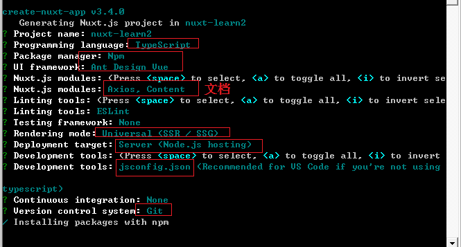
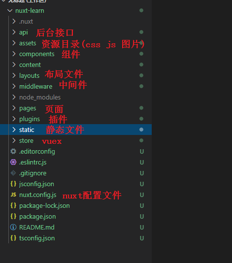
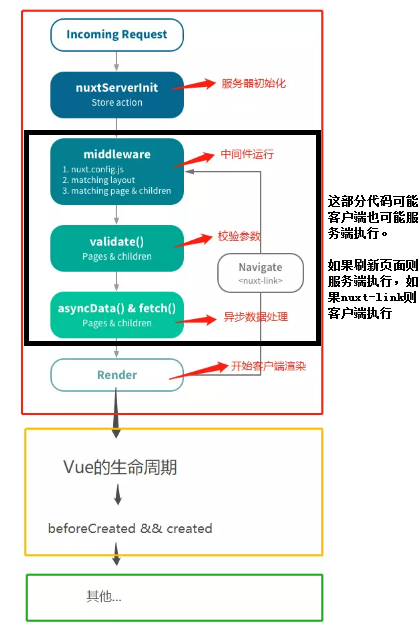

### 1.1 Nuxt简介

Nuxt 是一个基于 Vue 生态的更高层的框架，为开发服务端渲染(SSR)的 Vue 应用提供了极其便利的开发体验。

Vue.js是开发SPA单页面应用的，传统的SPA应用是将bundle.js从服务端获取，然后在客户端解析并挂载到dom。

Nuxt这个框架是用Vue开发多页应用，并在服务端渲染。我们可以将组件渲染为服务器端的 HTML 字符串，将它们直接发送到浏览器，最后将这些静态标记"激活"为客户端上完全可交互的应用程序。

Nuxt适合做新闻、博客、电影、咨询这样的需要搜索引擎提供流量的项目。如果你要做到是移动端项目，就没有必要用nuxt这个框架了。

```
Nuxt.js有如下特点：
Vue 2 ： nuxt是基于Vue2开发的
Vue Router  ： nuxt整合了路由功能，配置非常简单
VueX  ： 支持vuex
Vue Server Renderer  ： 支持服务端渲染
Vue-meta  ： 支持meta标签配置
```

### 1.2 Nuxt项目创建

https://zh.nuxtjs.org/guide/installation#%E6%96%B0%E6%89%8B%E6%A8%A1%E6%9D%BF

```javascript
//1.创建nuxt项目
$ npx create-nuxt-app@3.4.0 nuxt-learn

//2.nuxt模式选择Universal
   spa是单页，所以只有一个入口文件，不利于搜索引擎收录
   Universal 通用app，服务器渲染的 Vue.js 应用程序也可以被认为是"同构"或"通用"，因为应用程序的大部分代码都可以在服务器和客户端上运行

//3.注意不要选择pretty(会和eslint冲突)
    我们都知道，如何与团队其他人高效地进行协作开发是多人团队的一个痛点。
    每个人都有独立的编码习惯，虽然团队可以通过制定强制执行的规范来保持大家代码风格的尽量一致。
    但是，在实际编码过程中，个人可能会不经意地继续使用着自己的代码风格，而等到发现不一致再解决又未免有点迟。
    而ESLint正是为解决这类问题而生的。ESLint 由 JavaScript 红宝书 作者 Nicholas C. Zakas 编写， 2013 年发布第一个版本，t是一款当前应用十分广泛的JavaScript代码检查工具
    
//4.npm run dev
   访问  http://localhost:3000/
```





### 1.3 Nuxt基本使用

#### a) 路由

```javascript
//pages文件夹下面，文件名即路由

#1.pages下新建search.vue
<template>
  <div>
    这是search页面
  </div>
</template>


#2.index.vue使用路由
<nuxt-link to="/search">到search页面</nuxt-link>
```

#### b) 嵌套子模板

```javascript
#index.vue

#1.template
<template>
      <section class="container">
            <div>
              <Logo/>
             </div>
      </section>
</template>

<script>

#2. javascript
<script lang="ts">
import Vue from 'vue'
import Logo from '~/components/Logo.vue'
export default Vue.extend({
  components:{
    Logo
  }
})
</script>
```

#### c) layouts布局文件

默认情况下所有的页面都会默认使用layouts下面default.vue这个布局文件

```javascript
#default.vue
<template>
  <div>
    <h1>头部</h1>
    <!--nuxt就相当于 router-view-->
    <nuxt/>                     
    <h1>尾巴</h1>
  </div>
</template>
```

​	

```javascript
#自定义布局文件
#1.layouts下新建一个user.vue
<template>
  <div>
    <h1>用户页面头部</h1>
    <nuxt/>
    <h1>用户页面底部</h1>
  </div>
</template>

<script>
  export default{

  }
</script>

<style lang="css" scoped>
  h1{
    color:green
  }
</style>

#2.pages下的search.vue指定使用哪个布局文件
<script lang="ts">
import Vue from 'vue'
export default Vue.extend({
  layout:"user"
})
</script>
```

#### d) 全局的css文件

```javascript
#1.在assets下新建css/main.css

#2.修改nuxt.config.css配置文件
css: [
    'element-ui/lib/theme-chalk/index.css',
    '~/assets/css/main.css'
],

#3.重启服务
```

#### e) vuex的使用

在nuxt中使用vuex的时候无需new Vue.Store实例，nuxt会帮我们自动创建。默认情况下，会使用index.js这个store

```javascript
#1.store/index.js
export const state = () => ({
  list: ['a','b'],
  user:{}
})

export const mutations = {
  increment (state,text) {
    state.list.push(text);
  },
}
export const actions = {

}

#2.store/city.js
export const state = () => ({
  list: ['c','d']
})

export const mutations = {
  increment (state,text) {
    state.list.push(text);
  }
}

#3.pages/city.vue
<template>
  <div>
    Page is city
    <ul>
      <li v-for="(item, idx) in $store.state.list" :key="idx">{{ item }}</li>

      <input type="button" value="增加信息index" @click="addIndex" />

      <li v-for="(item, idx) in $store.state.city.list" :key="idx">
        {{ item }}
      </li>
    </ul>

    <input type="button" value="增加信息city" @click="addCity" />
  </div>
</template>

<script lang="ts">
import Vue from "vue";
export default Vue.extend({
  data() {
    return {
      list: [],
    };
  },
  methods: {
    addIndex() {
      this.$store.commit("increment", "kk");
    },
    addCity() {
      this.$store.commit("city/increment", "jj");
    },
  },
});
</script>
```

### 1.4 SPA\SEO\SSR

#### 1.4.1 SPA:单页面应用

SPA 时代，主要是在客户端端使用了`history`或`hash`（主要是为了低版本浏览器的兼容）API，在首次请求经服务端路由输出整个应用程序后，接下来的路由都由前端掌控了，前端通过路由作为中心枢纽控制一系列页面（组件）的渲染(DOM的生成)加载和数据交互。

> 优点

	页面之间的切换非常快
	一定程度减少了后端服务器的压力
	后端程序只需要提供api，不需要客户端到底是web端还是手机等

> 缺点

	首屏打开速度很慢，因为用户首次加载需要先下载SPA框架及应用程序的代码，然后在客户端渲染页面。
	不利于SEO搜索引擎优化

#### 1.4.2 SEO:搜索引擎优化

SEO是一种通过了解搜索引擎的运作规则（如何抓取网站页面，如何索引以及如何根据特定的关键字展现搜索结果排序等）来调整网站，以提高该网站在搜索引擎中某些关键词的搜索结果排名。

我们之前说SPA单页面应用，通过AJAX获取数据，这就难保证我们的页面能被搜索引擎正常收到，并且有一些搜索引擎不支持执行js和通过ajax获取数据，那就更不用提SEO了。为了解决这个问题，SSR登场了

#### 1.4.3 SSR:服务器端渲染

为了解决SPA不支持SEO的问题，我们也可以将同一个组件渲染为服务器端的 HTML 字符串，将它们直接发送到浏览器，但是这样的HTML页面还不具备交互能力，所以还需要与SPA框架配合，在浏览器上“混合”成可交互的应用程序。

基本流程是：

>  在浏览器第一次访问某个 URI 资源的时候（首屏），Web 服务器根据路由拿到对应数据渲染并输出，且输出的数据中包含两部分：
>
> - 路由页对应的页面及已渲染好的数据
> - 完整的SPA程序代码

	在客户端首屏渲染完成之后，此时我们看到的其实已经是一个和之前的 SPA 相差无几的应用程序了，接下来我们进行的任何操作都只是客户端的应用进行交互，页面/组件由Web端渲染，路由也由浏览器控制，用户只需要和当前浏览器内的应用打交道就可以了。

> SSR优点

	更好的 SEO，由于搜索引擎爬虫抓取工具可以直接查看完全渲染的页面。
	更快的内容到达时间(time-to-content)，不用等待所有的JS都下载完成，浏览器便能显示比较完整的页面了

> SSR缺点

	占用更多的cpu和内存资源
	一些常用的浏览器的api可能无法正常使用，比如window，document，alert等，如果使用的话需要对运行环境加以判断
	开发调试会有一些麻烦，因为涉及到了浏览器及服务器，对于SPA的一些组件的生命周期的管理会变得复杂

#### 1.4.4 Nuxt对SSR支持

从头搭建一个服务端渲染的应用是相当复杂的。幸运的是，我们有一个优秀的社区项目 [Nuxt.js](https://nuxtjs.org/) 让这一切变得非常简单。Nuxt 是一个基于 Vue 生态的更高层的框架，为开发服务端渲染的 Vue 应用提供了极其便利的开发体验。

Nuxt.js 是使用 Webpack 和 Node.js 进行封装的基于Vue的SSR框架，预设了利用Vue.js开发**服务端渲染**的应用所需要的各种配置，使用它你可以不需要自己搭建一套 SSR 程序，而是通过其约定好的文件结构和API就可以实现一个首屏渲染的 Web 应用。

Nuxt.js 主要关注的是应用的 UI渲染。

https://juejin.im/post/58ff960ba22b9d0065b722cd

### 1.5 数据预取

#### 1.5.1 准备服务器接口

```javascript
#1.在根目录创建api文件夹，创建city.js
const bodyParser = require("body-parser")
const app = require("express")()

app.use(bodyParser.json())

app.get('/info', (req, res) => {
  return res.status(200).json(['北京','天津'])
})

module.exports = app

#2.nuxt.config.js中添加配置如下
//https://zh.nuxtjs.org/guides/configuration-glossary/configuration-servermiddleware/
  serverMiddleware: [
    { path: "/api", handler: "~/api/city.js" },
  ]

#3.重启服务 访问接口
  localhost:3000/api/info  测试接口
```

#### 1.5.2 不使用数据预取

```javascript
#1.客户端pages下新建city.vue
<template>
  <div>
    Page is city
    <ul>
      <li
        v-for="(item,idx) in list"
        :key="idx"> {{ item }} </li>
    </ul>
  </div>
</template>

<script>
  import axios from "axios"
  import Vue from "vue";
  export default Vue.extend({
    data(){
      return {
        list:[]
      }
    },
    async mounted(){
      let {status,data} = await axios.get("/api/info");
      this.list = data;
      console.log(this.list);
    }
  })
</script>
```

#### 1.5.3 Nuxt.js工作流



> nuxtServerInit：如果在状态树(store)中指定了 `nuxtServerInit` 方法，Nuxt.js 调用它的时候会将页面的上下文对象作为第2个参数传给它（仅在服务端调用）。当我们想将服务端的一些数据传到客户端时，这个方法是非常好用的  
>
> middleware：中间件允许您定义一个自定义函数运行在一个页面或一组页面渲染之前，服务端首屏渲染和路由跳转前均执行对应中间件。可以用作页面跳转时验证用户信息操作(登陆拦截)。
>
> asyncData会在组件加载前（限于页面组件）调用，可以在**服务端首屏渲染或者在路由跳转时执行**，专门用来请求数据，Nuxt.js 会将 `asyncData` 返回的数据融合组件 `data` 方法返回的数据一并返回给当前组件。asyncData应该是用于影响SEO的内容，也就是需要让爬虫读取的内容。

#### 1.5.4 数据预取

##### a)  nuxtServerInit

nuxtServerInit可以将服务端的数据通过vuex同步到客户端，该方法仅会在服务端首屏渲染时执行

```javascript
#store/index.js
export const state = () => ({
  list: ['a','b'],
  user:{}
})

export const mutations = {
  increment (state,text) {
    state.list.push(text);
  },
  setlist (state,text) {
    text.forEach(item=>{
      state.list.push(item)
    })
  },
}
export const actions = {
  //将菜单信息写入到vuex实例中
  async nuxtServerInit ({ commit }, { req ,app }) {
    {
      let {status, data} = await app.$axios.get("/api/info");
      commit('setlist', data)
    }
  }
}


#2.pages/city.vue
<template>
  <div>
    Page is city
    <ul>
      <li
        v-for="(item,idx) in $store.state.list"
        :key="idx"> {{ item }} </li>
    </ul>
  </div>
</template>
```

##### b) asyncData和fetch方法

```javascript
//使用asyncData进行ssr渲染
async asyncData(){
    //给data取别名，请求网址写全，因为在刷新浏览器的时候需要全路径请求服务器
    let {status,data:list} = await axios.get("http://127.0.0.1:3000/city/info");
    if(status == 200) {
        //这边不能使用this.list = list,因为获取不到this
        //通过return给页面返回数据
        return {
            list
        }
    }
}

async fetch ({ store, params }){
      //当页面加载时触发可以执行请求来触发action来修改state
      //不可以return数据给页面
      //页面可以从this.$store中获取action修改的state
      let {status,data:list} = await axios.get("http://127.0.0.1:3000/city/info");
      store.commit('setlist', list)
}

#注意点：asyncData 和 fetch都只能够在页面组件中使用，如果想要在页面组件的子组件中使用ssr，可以使用nuxtServerInit
#注意点：由于 asyncData方法是在组件初始化前被调用的，所以在方法内是没有办法通过this来引用组件的实例。
#注意点：当用户请求页面时候服务端会先使用SSR来生成对应的页面文档结构，而在用户切换路由则是使用了SPA的模式。这意味着如果用户刷新页面，asyncData方法会在服务端执行；如果用户通过nuxt-link路由导航到当前页面，asyncData会在客户端执行
```

> ****

##### c) asyncData运行在服务器和客户端的区分

当asyncData方法是由路由跳转触发的时候，则使用客户端数据预取，asyncData方法会在客户端执行。可以通过控制台打印来查看是在浏览器执行还是在node执行就可以验证了。

```javascript
//https://zh.nuxtjs.org/api/#asyncdata-%E6%96%B9%E6%B3%95

async asyncData(context){
    //给data取别名，请求网址写全
    let {status,data:list} = await axios.get("http://127.0.0.1:3000/city/info");
    //如果是客户端执行，则可以使用window对象
    //如果是服务端执行，则没有window对象
    if(process.client){
        console.log(window)
    }

    if(status == 200) {
        //这边不能使用this.list = list,因为获取不到this
        //通过return给页面返回数据
        return {
            list
        }
    }
}
```

### 1.6 SSR原理


**官方文档**:https://ssr.vuejs.org/zh/

如上图所示：webpack将 Source 打包出两个bundle文件。

服务端渲染：Server Bundle用于服务端渲染，主要是获取异步数据，同步到组件中，并将组件渲染成HTML返回到前端，但是**vue-ssr不能绑定javascript事件**，也就是说服务器端使用vue-ssr渲染出来的返回到浏览器的也只能是HTML+CSS。

客户端渲染：Client Bundle 用于客户端渲染，之前说过服务器不能增加事件，那只能前端增加。所以我们看到SSR渲染的网页源码中有`window.__NUXT__=...`代码，这是后端和前端在使用vuex共享数据。后端从vuex里面取到数据之后渲染成真正的HTML和css返回。客户端也是从vuex里面取到数据，客户端的渲染主要做2件事：

> 1.拿到数据，使用	virtual-dom进行预渲染，然后和服务端渲染出来的进行比对，比对两边渲染的内容是不是一致的
>
> 2.对DOM元素的事件进行绑定，也就是回答的问题，事件在这块进行的处理


