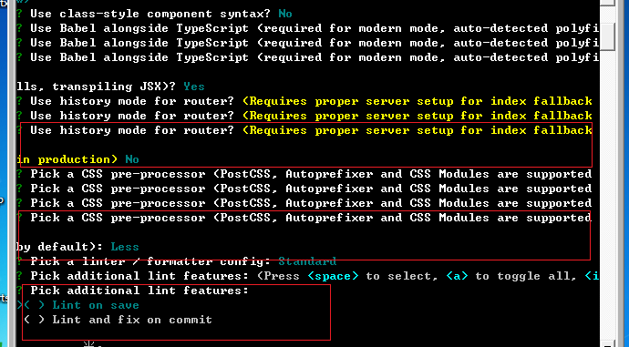
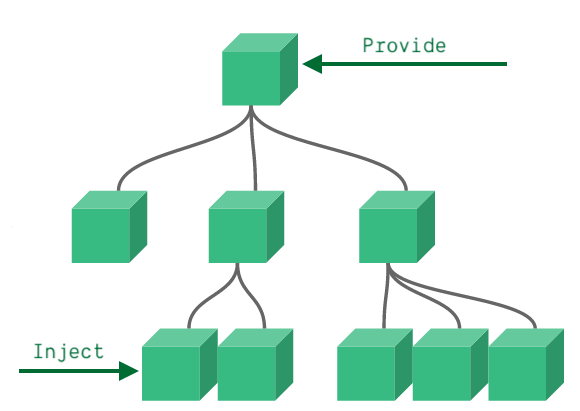

# 1. Vue/cli脚手架介绍

vue-cli是vue官网提供的一个脚手架，这个构建工具大大降低了webpack的使用难度，支持热更新，有**webpack-dev-server**的支持，相当于启动了一个请求服务器，给你搭建了一个测试环境，只关注开发就OK

## 1.1 安装vue-cli创建Vue2.x项目

```javascript
//1.之前安装过vue的2.0版本，你需要把2.0相关的删除  npm uni -g vue-cli

//2.安装vue/cli脚架  npm i -g @vue/cli@4.5.8

//3.将配置环境变量  C:\dev\nodejs

//4.检查版本号,目前安装vuecli 4.5.8    vue -V

//5.创建项目  vue create project-name
    选择vue2x
```


```javascript
//查看最终生效的 webpack 配置信息
vue inspect > output.js

//配置文件参考文档
https://cli.vuejs.org/zh/config/#devserver-proxy

//运行App
npm run serve

//编译App
npm run build
```


## 1.2 windows(32位) npm装不上vue/cli的问题


## 1.3 vue.config.js配置

```javascript
//官网配置： https://cli.vuejs.org/zh/config/#filenamehashing

const path = require('path');
const debug = process.env.NODE_ENV !== 'production'

module.exports = {
  //部署应用包时的基本URL，如果是生产环境，部署到 /cli-study/dist 路径；如果是开发环境，部署到根路径
  publicPath: !debug
      ? '/cli-study/dist'
      : '/',
  //输出文件路径
  outputDir: 'dist',
  //放置生成的静态资源 (js、css、img、fonts) 的 (相对于 outputDir 的) 目录。
  assetsDir: 'static',
  //默认情况下，生成的静态资源在它们的文件名中包含了 hash 以便更好的控制缓存
  filenameHashing: true,
  // eslint-loader 是否在保存的时候检查
  lintOnSave: false,
  // 是否使用包含运行时编译器的Vue构建版本，设置为 true 后你就可以在 Vue 组件中使用 template 选项了，但是这会让你的应用额外增加 10kb 左右。
  runtimeCompiler: true,
  // 默认情况下 babel-loader 会忽略所有 node_modules 中的文件。如果你想要通过 Babel 显式转译一个依赖，可以在这个选项中列出来。
  transpileDependencies: [],
  // 生产环境不需要sourceMap
  productionSourceMap: false,

  // 官网：https://cli.vuejs.org/zh/guide/webpack.html#%E7%AE%80%E5%8D%95%E7%9A%84%E9%85%8D%E7%BD%AE%E6%96%B9%E5%BC%8F
  // 更多配置参考：https://www.jb51.net/article/150844.htm
  configureWebpack: config => {
    Object.assign(config, { // 开发生产共同配置
      resolve: {
        alias: {
          '@': path.resolve(__dirname, './src'),
          'vue$': 'vue/dist/vue.esm.js'
        }
      }
    })
  },

  // webpack的链式操作，允许对内部的 webpack 配置进行更细粒度的修改
  // 参考： https://cli.vuejs.org/zh/guide/webpack.html#%E9%93%BE%E5%BC%8F%E6%93%8D%E4%BD%9C-%E9%AB%98%E7%BA%A7
  chainWebpack: (config) => {
    if (debug) {
      // 本地开发配置
    }
    else {
      // 生产开发配置
    }
  },

  // css的相关配置
  css: {
  },
  //所有 webpack-dev-server 的选项都支持
  devServer: {
    open: true,
    host: '127.0.0.1',
    port: 3000,
    https: false,
    hotOnly: false,
    proxy: null,
  },
  // 第三方插件配置
  pluginOptions: {}
};
```

## 1.4 Eslint格式化.vue文件

ESLint是一个用来识别 ECMAScript 并且按照规则给出报告的代码检测工具，使用它可以避免低级错误和统一代码的风格。

你可能有疑问，在.vue 文件中你怎么检验你的代码，因为它不是 JavaScript。我们假设你使用 [ESLint](https://eslint.org/) (如果你没有使用话，你应该去使用！)。

你还需要官方的 [eslint-plugin-vue](https://github.com/vuejs/eslint-plugin-vue)，它支持同时检查你.vue文件中的模板和脚本。

https://vue-loader-v14.vuejs.org/zh-cn/workflow/linting.html

### eslint配置(rules规则)

```javascript
// 关闭必须使用单引号
"quotes": [0, "single"],
// 允许多余的换行
"no-multi-spaces": 0,

'no-console': process.env.NODE_ENV === 'production' ? 'error' : 'off',
'no-debugger': process.env.NODE_ENV === 'production' ? 'error' : 'off',

'prefer-promise-reject-errors': 0,
'space-unary-ops': 0,
'no-unused-expressions': 0,
'no-useless-return': 0,
'standard/no-callback-literal': 0,
'import/first': 0,
'import/export': 0,
'no-mixed-operators': 0,
'no-use-before-define': 0,

// 不允许使用分号
'semi': [2, 'never'],

// 允许使用==
'eqeqeq': 0,

// 缩进使用不做限制
'indent': 2,

// 允许使用tab
'no-tabs': 0,

// 函数圆括号之前没有空格
'space-before-function-paren': [2, 'never'],

// 不要求块内空格填充格式
'padded-blocks': 0,

// 不限制变量一起声明
'one-var': 0,

// 条件语句中复制操作符需要用圆括号括起来
'no-cond-assign': [2, 'except-parens'],

// 允许使用条件表达式使用常量
'no-constant-condition': 2,

// 单行可忽略大括号，多行不可忽略
'curly': [2, 'multi-line'],

// 不允许使用var变量
'no-var': 2,

// 不允许出现多个空格
'no-multi-spaces': ['error', { ignoreEOLComments: true }],
'camelcase': 0,

// 对象字面量的键值空格风格
'key-spacing': 2,

// if语句包含一个return语句， else就多余
'no-else-return': 2,

// 建议将经常出现的数字提取为变量
'no-magic-numbers': [0, { ignoreArrayIndexes: true }],

// 不允许重复声明变量
'no-redeclare': [2, { builtinGlobals: true }],

// 立即执行函数风格
'wrap-iife': [2, 'inside'],

// 不允许圆括号中出现空格
'space-in-parens': [2, 'never'],

// 确保运算符周围有空格
'space-infix-ops': 2,

// 强制点号与属性同一行
'dot-location': [2, 'property'],

// 强制单行代码使用空格
'block-spacing': [2, 'always'],

// 约束for-in使用hasOwnProperty判断
'guard-for-in': 0,

// 采用one true brace style大括号风格
'brace-style': [2, '1tbs', { 'allowSingleLine': true }],

// 统一逗号周围空格风格
'comma-spacing': [2, { 'before': false, 'after': true }],

// 禁止出现多个空行
'no-multiple-empty-lines': [2, { 'max': 1, 'maxEOF': 2 }],

// 允许箭头函数不使用圆括号
'arrow-parens': 0,

// 规范generator函数的使用
'generator-star-spacing': [2, { 'before': false, 'after': true }],

// 要求在块级
'lines-around-comment': [2, { 'beforeBlockComment': true, 'afterBlockComment': false, 'beforeLineComment': true, 'afterLineComment': false }]


"off"或者0，不启用这个规则
"warn"或者1，出现问题会有警告
"error"或者2，出现问题会报错
```

https://github.com/vuejs/eslint-plugin-vue/blob/master/docs/rules/README.md

> 注意："extends": "plugin:vue/recommended" 会同时检查js和模板的语法错误

```
vscode中通过  npm run lint会自动进行eslint的校验和修正
npm run lint --fix
```

# 2. Vue3.0介绍

官方文档：https://vue-docs-next-zh-cn.netlify.app/guide/installation.html

## 2.1 Vue3.0 项目创建

创建:在命令窗口输入指令

```javascript
vue create 项目名称    
//选择vue3.x
```




## 2.2  Vue composition API (函数式api)

vue 3.0 的 Composition API 带来的最大的特性，就是函数组件。通过函数组件，我们可以体会到类似 react 编程的愉悦。

使用传统的option配置方法写组件的时候问题，随着业务复杂度越来越高，代码量会不断的加大；由于相关业务的代码需要遵循option的配置写到特定的区域(data、methods、computed)，导致后续维护非常的复杂，同时代码可复用性不高，而composition-api就是为了解决这个问题而生的

vue3.0 侧重于解决代码组织与逻辑复用问题

### 2.2.1 defineComponent

在结合了 TypeScript 的情况下，传统的 Vue.extend 等定义方法无法对组件给出正确的参数类型推断，这就需要引入 defineComponent() 组件包装函数

### 2.2.2 setup

vue3.0将组件的逻辑都写在了函数内部，setup()会取代vue2.x的data()函数，返回一个对象暴露给模板。

**setup函数的特性：**

- 使用Composition API 的入口
- 在beforeCreate之前调用
- 在setup中没有this (函数组件)
- 可以返回一个对象，这个对象的属性被合并到渲染上下文，并可以在模板中直接使用；
- 接收props对象作为第一个参数，接收来的props对象，可以通过watch监视其变化。
- 接受context对象作为第二个参数，这个对象包含attrs，slots，emit三个属性。

setup 函数是个新的入口函数，相当于 vue2.x 中 beforeCreate 和 created，在 beforeCreate 之后 created 之前执行。

```javascript
setup() {
    const msg = "张晓明";
    let age = 18;
    function add() {
        age += 1;
        console.log(age)
    }
    return { msg, age, add };
},
  
<div class="home">
    姓名:{{msg}}
    年龄:{{age}}
    <button @click="add">点我年龄加1</button>
</div>

//数据绑定的用法和之前vue语法一致
```

### 2.2.3 ref

ref可以让某一个变量具备响应式的能力

**ref 注意点:**

- 在 VUE 的模板中使用 ref 的值不需要通过 value 获取 （Vue 会通过自动给 ref 的值加上 .value）


- 在 js 中使用 ref 的值必须使用 .value 获取

```javascript
import { defineComponent, ref } from "vue";
setup() {
    const msg = ref("张晓明");
    let age = ref(18);
    function add() {
      age.value += 1;
    }
    return { msg, age, add };
},
```

### 2.2.4 reactive

经过reactive函数处理后的对象能变成响应式的对象，类似于option api里面的data属性的值，它主要是处理你的对象让它经过 `Proxy` 的加工变为一个响应式的对象。

注意点：

- 如果想要保持对象内容的响应式能力，在 return 的时候必须把整个 `reactive()` 对象返回出去


- 在引用的时候也必须对整个对象进行引用而无法解构，否则这个对象内容的响应式能力将会丢失。
- Vue2.x版本中 Vue 使用了 `Object.defineProperty()` 来劫持数据变化，Vue3.0中使用 `Proxy` 来劫持数据变化

```javascript
<template>
  <div class="home">
    名字:{{ state.name }} 价格:{{ state.price }}
    购买数量:{{state.count}}
    <button @click="add">点我加1</button>
  </div>
</template>

<script lang="ts">
import { defineComponent, ref, reactive } from "vue";

export default defineComponent({
  name: "Home",
  components: {
  },
  setup() {
    //响应式对象
    const state = reactive({
      count: 0,
      name:"商品1",
      price:100
    });
    //修改响应式对象
    function add() {
      state.count += 1;
    }
    return { state, add };
  },
});
</script>
```

### 2.2.5 toRefs

但是在具体的业务中，如果无法使用解构取出 `reactive()` 对象的值，每次都需要通过 `state.` 操作符访问它里面的属性会是非常麻烦的，所以官方提供了 `toRefs()` 函数来为我们填好这个坑。只要使用 `toRefs()` 把 `reactive()` 对象包装一下，就能够通过解构单独使用它里面的内容了，而此时的内容也依然维持着响应式的特性。

```javascript
<template>
  <div class="home">
    名字:{{ name }} 价格:{{ price }}
    购买数量:{{count}}
    <button @click="add">点我加1</button>
  </div>
</template>

<script lang="ts">
import { defineComponent, ref, reactive,toRefs } from "vue";

export default defineComponent({
  name: "Home",
  components: {
  },
  setup() {
    //响应式对象
    const state = reactive({
      count: 0,
      name:"商品1",
      price:100
    });
    //修改响应式对象
    function add() {
      state.count += 1;
    }
    return { ...toRefs(state), add };
  },
});
</script>
```

### **2.2.6 watch和computed**

**computed**：该函数用来创造计算属性，和过去一样，它返回的值是一个ref对象。里面可以传方法，或者一个对象，对象中包含set()、get()方法

**watch**：属性监听，支持传三个参数

- 想监听的数据，可以是数组形势，传入多个
- 监听数据的回调函数，该回调的参数有两个，前一个是newValue，后一个是oldValue，每一个都可以是一个数组，与之前的多个监听对应
- 监听的配置参数 是一个对象，如{ immediate: true }，这样可以让初次挂在时执行watch的回调

```javascript
<template>
  <div class="home">
    名字:{{ name }} 价格:{{ price }}
    购买数量:{{count}}
    双倍数量:{{double}}
    Title:{{title}}
    <button @click="add">点我加1</button>
    <button @click="title = '123'">修改title</button>
  </div>
</template>

<script lang="ts">
import { defineComponent, ref, reactive,toRefs,computed,watch } from "vue";

export default defineComponent({
  name: "Home",
  components: {
  },
  setup() {
    //响应式对象
    const state = reactive({
      count: 0,
      name:"商品1",
      price:100
    });
    const title = ref("标题")

    //计算属性
    const double = computed(() => state.count * 2)

    //watch监听reactive数据
    watch(()=>state.count,(newCount,oldCount)=>{
      console.log(newCount,oldCount)
    },{ immediate: true })
    //watch监听ref数据
    watch(title,()=>{

    })
    //watch监听一组数据变化
    watch([title,()=>state.count],([newTitle,newCount],[oldTitle,oldCount])=>{
      console.log(newTitle,newCount)
    })

    //修改响应式对象
    function add() {
      state.count += 1;
    }
    return { ...toRefs(state),double, add,title };
  },
});
</script>
```

### 2.2.7 props 和 context

在 `Vue2.0` 中我们可以使用 `props` 属性值完成父子通信，在这里我们需要定义 `props` 属性去定义接受值的类型，然后我们可以利用 `setup` 的第一个参数获取 `props` 使用。

#### a) 父传子

```javascript
//父组件
<template>
  <div class="home">
    <HelloWorld :msg="title"></HelloWorld>
    <button @click="title = '123'">修改title</button>
  </div>
</template>

<script lang="ts">
import { defineComponent, ref, reactive, toRefs, computed, watch, onMounted } from "vue";
import HelloWorld from '@/components/HelloWorld.vue';

export default defineComponent({
  name: "Home",
  components: {
    HelloWorld
  },
  setup() {
    const title = ref("标题");
    return {  title };
  }

});
</script>

```

```javascript
//子组件
<template>
  <div class="hello">
    <h1>{{ msg }}</h1>
  </div>
</template>

<script lang="ts">
import { defineComponent, ref,watch } from "vue";

export default defineComponent({
  name: "HelloWorld",
  props: {
    msg: String,
  },
  setup(props) {
    //监听props中的msg变化
    watch(()=>props.msg,(newVal)=>{
      console.log(newVal)
    })
  },
});
</script>
```

#### b) 子传父

```javascript
//父组件
setup() {
    const title = ref("标题");

    const receiveFromChild = (msg: any) => {
        title.value = msg;
    };
    return { title, receiveFromChild };
},
  
<HelloWorld :msg="title" @func="receiveFromChild"></HelloWorld>
```

```javascript
//子组件
<button @click="send">向父亲传递数据</button>


//setup 函数的第二个参数是一个上下文对象，这个上下文对象中包含了一些有用的属性(slot attrs emit)，这些属性在 Vue2.0 中需要通过 this 才能访问到，在 vue3.0中需要通过context来访问：
//注意 vue3.0中没有组件对象，不能通过this来访问组件对象
setup(props,context) {
    const send = ()=>{
        context.emit("func","孩子的数据")
    }
    return {send}
},
```

#### c) provide和inject



```javascript
//父组件
import { defineComponent,provide } from "vue";
setup() {
    provide("list",['张三','李四','王五'])
    return { };
}

//子组件
import { defineComponent, inject } from "vue";
setup(props, context) {
    const list = inject("list");
    console.log(list);
    return { };
}

//注意：provide和inject只能在setup()函数中使用
```

### 2.2.8 过滤器、自定义指令

#### a) 过滤器

vue3.0不再支持过滤器，官方建议我们用methods、computed来替换他们

#### b) 自定义指令

```javascript
//自定义全局指令
const app = Vue.createApp({})
app.directive('focus', {
  // 当被绑定的元素插入到 DOM 中时……
  mounted(el) {
    el.focus()
  }
})
```

```javascript
//自定义局部指令
directives: {
  focus: {
    // 指令的定义
    mounted(el) {
      el.focus()
    }
  }
}
```

### 2.2.9 ref引用页面元素

```javascript
<template>
  <div class="home">
    <input type="text" ref="inputRef" />
    <button @click="showRef">点我显示input内容</button>
  </div>
</template>

<script lang="ts">
import { defineComponent, ref } from "vue";
import HelloWorld from "@/components/HelloWorld.vue";

export default defineComponent({
  name: "Home",
  components: {
    HelloWorld,
  },
  setup() {
    const inputRef = ref();
    const showRef = () => {
      console.log(inputRef.value && inputRef.value.value);
    };
    return { inputRef, showRef };
  },
});
</script>
```

### 2.2.10 vue3.0生命周期钩子


```javascript
onMounted(()=>{
    console.log("onMounted")
})
```

## 2.3 vue-router的使用

### 2.3.1 基本使用

https://router.vuejs.org/zh/guide/essentials/passing-props.html

router/index.ts

```javascript
//createRouter创建路由对象
//createWebHashHistory hash模式
//RouteRecordRaw每一条路由规则的类型文件
import { createRouter, createWebHashHistory, RouteRecordRaw } from 'vue-router'
import Home from '../views/Home.vue'

//路由规则
const routes: Array<RouteRecordRaw> = [
  {
    path: '/',
    name: 'Home',
    component: Home
  },
  {
    path: '/about',
    name: 'About',
    component: () => import(/* webpackChunkName: "about" */ '../views/About.vue')
  }
]

//创建一个路由对象
const router = createRouter({
  history: createWebHashHistory(),
  routes
})

export default router
```

```javascript
//main.ts挂载路由
createApp(App).use(store).use(router).mount('#app')

//App.vue中使用 router-link和router-view
<template>
  <div id="nav">
    <router-link to="/">Home</router-link> |
    <router-link to="/about">About</router-link>
  </div>
  <router-view/>
</template>
```

### 2.3.2 动态路由参数

```javascript
//1.修改路由配置
const routes: Array<RouteRecordRaw> = [
  {
    path: '/',
    name: 'Home',
    component: Home
  },
  {
    path: '/about/:id',
    props: true,             //如果 props 被设置为 true，route.params 将会被设置为组件属性
    name: 'About',
    component: () => About
  }
]


//2.App.vue跳转路由传参
<template>
  <div id="nav">
    <router-link to="/">Home</router-link> |
    <router-link to="/about/123">About</router-link>
  </div>
  <router-view/>
</template>


//3.About.vue中使用动态路由参数
<template>
  <div class="about">
    <h1>This is an about page {{$route.params.id}}</h1>
  </div>
</template>

<script>
export default {
  props:['id'],
  created(){
    console.log(this.id)
  }
}
</script>
```

### 2.3.3 路由传参

```javascript
//1.修改路由配置
const routes: Array<RouteRecordRaw> = [
  {
    path: "/",
    name: "Home",
    component: Home
  },
  {
    path: "/about",
    ///search?q=vue 会将 {query: 'vue'} 作为属性传递给 SearchUser 组件。
    props: route => ({ query: route.query.q, query2: route.query.m }),
    name: "About",
    component: () => About
  }
];


//App.vue
<template>
  <div id="nav">
    <router-link to="/">Home</router-link> |
    <router-link to="/about?q=vue&m=123">About</router-link>
  </div>
  <router-view/>
</template>


//About.vue
<script>
export default {
  props:['query','query2'],
  created(){
    console.log(this.query,this.query2)
  }
}
</script>
```

### 2.3.4 编程式导航

```javascript
<template>
  <div class="about">
    <h1>This is an about page</h1>
    <button @click="goHome">点我跳转页面</button>
  </div>
</template>

<script>
import { defineComponent, ref } from "vue";

import { useRouter } from "vue-router";
export default {
  setup() {
    const router = useRouter();
    const goHome = () => {
      router.push("/");
    };
    return { goHome };
  },
};
</script>
```

### 2.3.5 导航钩子函数

#### a) 路由级的导航钩子

```javascript
const routes: Array<RouteRecordRaw> = [
  {
    path: "/",
    name: "Home",
    component: Home
  },
  {
    path: "/about",
    name: "About",
    component: () => About,
    //路由级的导航钩子
    beforeEnter:(to,from,next)=>{
      console.log("beforeEnter",to,from,next)
      next();
    }
  }
];
```

#### b) 全局的导航钩子

```javascript
const router = createRouter({
  history: createWebHashHistory(),
  routes
});


//全局导航钩子
router.beforeEach((to, from, next) => {
  console.log("全局前置 beforeEach");
  next();
})
router.afterEach( route => {
  console.log("全局后置 afterEach");
})
```

#### c) 组件级的导航钩子

```javascript
<script>
import { defineComponent, onMounted, ref } from "vue";

import { onBeforeRouteLeave, onBeforeRouteUpdate, useRouter } from "vue-router";
export default {
  setup() {
    const router = useRouter();
    const goHome = () => {
      router.push("/");
    };

    //组件级的导航钩子
    onBeforeRouteLeave((to,from,next) => {
      console.log("onBeforeRouteLeave",to,from,next);
      next();
    });
    onBeforeRouteUpdate((to,from,next) => {
      console.log("onBeforeRouteUpdate",next);
      next();
    });


    return { goHome };
  },
};
</script>
```

## 2.4 vuex的使用

```javascript
//store/index.ts
import { createStore } from 'vuex'

export default createStore({
  state: {
    count: 0
  },
  mutations: {
      increment(state) {
          state.count++
      },
      subtract(state, obj) {
          console.log(obj)
          state.count -= obj.step;
      }
  },
  getters: {
      optCount: function (state) {
          return '当前最新的count值是：' + state.count
      }
  },
  actions: {
  },
  modules: {
  }
})
```

```javascript
//main.ts
createApp(App).use(store).use(router).mount('#app')
```

```javascript
//Home.vue
<template>
  <div class="home">
    <p>count值是:{{ state.count }}</p>
    <p>getters值是:{{ getters.optCount }}</p>
    <button @click="doAdd">点我+1</button>
    <button @click="doSub">点我-若干</button>
  </div>
</template>

<script lang="ts">
import { computed, defineComponent, ref } from "vue";
import { useStore } from "vuex";
import HelloWorld from "@/components/HelloWorld.vue";

export default defineComponent({
  name: "Home",
  components: {
    HelloWorld,
  },
  setup() {
    //获取store中的信息
    const { state, getters, dispatch, commit } = useStore();

    const doAdd = () => {
      console.log("doAdd",commit)
      commit("increment");
    };
    const doSub = () => {
      commit("subtract", { step: 3 });
    };

    return { state, getters,doAdd,doSub };
  },
});
</script>
```

## 2.5 vant组件库的使用

### 2.5.1 全局引入

```javascript
//1.安装vant-ui
//注意：3.0项目中安装vue@next
npm i vant@next -S

//2.main.ts全局引入Vant UI的样式以及组件库
import Vant from 'vant';
import 'vant/lib/index.css';

createApp(App).use(Vant).use(store).use(router).mount('#app')

//3.Home.vue中使用vant组件库
<van-button type="default" @click="showPopup">默认按钮</van-button>
<van-button type="primary">主要按钮</van-button>
<van-button type="info">信息按钮</van-button>
<van-button type="warning">警告按钮</van-button>
<van-button type="danger">危险按钮</van-button>

<van-popup v-model:show="flag">内容</van-popup>


<script lang="ts">
import { computed, defineComponent, ref } from "vue";
export default defineComponent({
  name: "Home",
  components: {
  },
  setup() {
    const flag = ref(false);
    const showPopup = ()=>{
      flag.value = true;
    }
    return { flag,showPopup };
  },
});
</script>
```

### 2.5.2 按需加载

```javascript
//1.安装babel-plugin-import
npm i babel-plugin-import -D

//2.修改babel.config.js
module.exports = {
  presets: [
    '@vue/cli-plugin-babel/preset'
  ],
  plugins: [
    ['import', {
      libraryName: 'vant',
      libraryDirectory: 'es',
      style: true
    }, 'vant']
  ]
}

//3.修改main.ts
import { Button,Popup } from 'vant';
createApp(App).use(Button).use(Popup).use(store).use(router).mount('#app')


//4.Home.vue使用vant组件
<template>
  <div class="home">
    <van-button type="default" @click="showPopup">默认按钮</van-button>
    <van-button type="primary">主要按钮</van-button>
    <van-button type="info">信息按钮</van-button>
    <van-button type="warning">警告按钮</van-button>
    <van-button type="danger">危险按钮</van-button>

    <van-popup v-model:show="flag">内容</van-popup>
  </div>
</template>
```

## 2.6 vue3.0和vue2.0比较

vue3.0 的发布与 vue2.0 相比，优势主要体现在：更快、更小、更易维护、更易于原生、让开发者更轻松；

**更快**

　　1、virtual DOM 完全重写，mounting & patching 提速 100%；

　　2、更多编译时 （compile-time）提醒以减少 runtime 开销；

　　3、基于 Proxy 观察者机制以满足全语言覆盖以及更好的性能；

　　4、放弃 Object.defineProperty ，使用更快的原生 Proxy；

　　5、组件实例初始化速度提高 100%;

　　6、提速一倍/内存使用降低一半；

**更小**

　　1、Tree-shaking 更友好；（*tree shaking* 是一个术语，通常用于描述移除 JavaScript 上下文中的未引用代码(dead-code)）

　　2、新的 core runtime：~ 10kb gzipped；