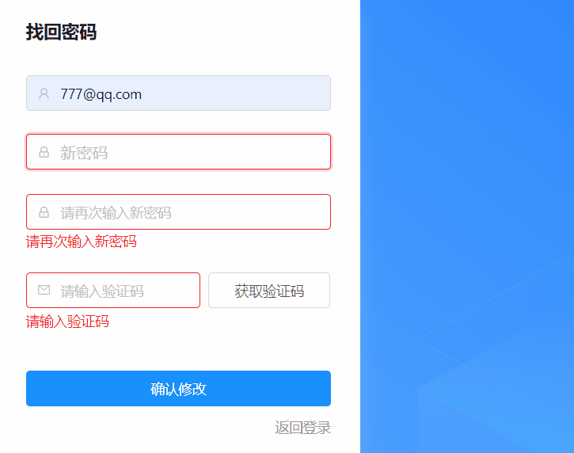
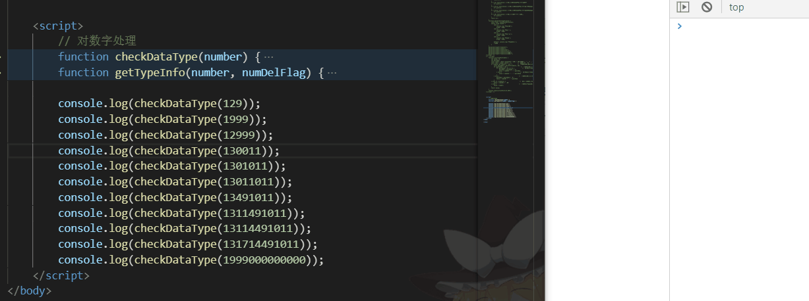

# 一、判断密码强度

## 1.纯js部分

```js
 progStatus = 0;             // 当前包含的种类
 correctTypePwd = false;     // 当密码种类超过两种时为true，纯数字或者字母则为false
 valueLength = 0;            // 当前输入的密码长度
---------------------------------------------

// 校验密码强度
  checkPwdStrongth(value) {    
    const arr = [];
    this.progStatus=0;
    if (value) {
      if (value.length < 8) {// 最初级别 密码小于8位
        return arr;
      }
      if (/\d/.test(value)) {// 如果用户输入的密码 包含了数字
        arr.push(1);
      }
      if (/[a-z]/.test(value)) {// 如果用户输入的密码 包含了小写的a到z
        arr.push(2);
      }
      if (/[A-Z]/.test(value)) {// 如果用户输入的密码 包含了大写的A到Z
        arr.push(3);
      }
      if (/\W/.test(value)) {// 如果是非数字 字母 下划线
        arr.push(4);
      }
    }
    this.progStatus=arr.length; 
    if (value) {
      this.valueLength=value.length;   
    }
    
    if (JSON.stringify(arr)!=='[]' && arr.length>=2) {
      this.correctTypePwd=true;
    }else{
      this.correctTypePwd=false;
    }
    
    return arr;
  }
```

```js
  passwordstrength(value) {
    // 复合判断密码强弱 根据实际情况修改
    if(!this.correctTypePwd){
        console.log('密码不满足要求');    // 当前要求为密码位数大于等于8位，且最少有两种组合
        return;
    }
    // 判断密码强弱的模板，可据实际情况修改。
    // 当前判断根据是:密码小于8位为不合格，纯数字或字母为1，两种为2，依次类推
    const flag = this.checkPwdStrongth(value);
    switch (flag.length) {
      case 1:
        console.log('密码太弱');
        break; //可选
      case 2:
        console.log('密码中');
        break; //可选
      case 3:
        console.log('密码中上');
        break; //可选
      case 4:
        console.log('密码强');
        break; //可选

      default: console.log('密码不合格');
      //语句
    }
  }
```

## 2.在angular中的实例演示

### 2.1 html部分

```html
<!-- 
	代码重点：
		1. 使用Popover气泡卡片 nz-popover
		2. nzPopoverTrigger="focus"          // 气泡卡片通过focus触发
		3. [nzPopoverContent]="pwdCdkTpl"    // 气泡卡片的内容是标记为#pwdCdkTpl的元素
-->

<nz-input-group
  nzSize="large"
  nz-popover
  nzPopoverTrigger="focus"
  [nzPopoverContent]="pwdCdkTpl"
>
  <input nz-input type="password" placeholder="新密码" 
         [ngClass]="{'error-pwd': !correctTypePwd&&valueLength>=8}" />
</nz-input-group>

<ng-template #pwdCdkTpl>
  <div style="padding: 4px 0;">
    <ng-container [ngSwitch]="status">
      <div *ngSwitchCase="'ok'" class="success">强度：强</div>
      <div *ngSwitchCase="'pass'" class="warning">强度：中</div>
      <div *ngSwitchCase="'pooler'" class="error">强度：弱</div>
      <div *ngSwitchDefault class="error">强度：太短</div>
    </ng-container>
    <ul class="progress-status">
      <li [ngClass]="{'errorColor': progStatus===0||progStatus===1,'passColor':progStatus===2,'okColor':progStatus>2&&progStatus<5}"></li>
      <li *ngFor="let item of perfectStatus;let key=index"  [ngClass]="{'grayColor':progStatus===0,'errorColor': key<1&&progStatus===1,'passColor':key<2&&progStatus===2,'okColorS':key<3&&progStatus===3,'okColor':key<4&&progStatus===4}"></li>
    </ul>
    <p class="pTip">请至少输入 8 个字符,同时包含字母和数字</p>
  </div>
</ng-template>
```

### 2.2 ts部分

```ts
status = 'pool';
perfectStatus = [1,2,3,4];  // 强度种类数组
progStatus = 0;             // 当前包含的种类
correctTypePwd = false;     // 当密码种类超过两种时为true，纯数字或者字母则为false
valueLength = 0;            // 当前输入的密码长度

 //  不能直接复制使用 仅供了解
  static checkPassword(control: FormControl) {
    if (!control) return null;
    const self: any = this;
    self.visible = !!control.value;
 
    const num = self.checkPwdStrongth(control.value);    
    switch (num.length) {
      case 1:
        self.status = 'pooler';
        break; 
      case 2:
        self.status = 'pass';
        break; 
      case 3:
        self.status = 'ok';
        break; 
      case 4:
        self.status = 'ok';
        break; 
      default:
        self.status = 'pool';
    }
  }

 // 校验密码强度---沒有匹配到以下級別就提示
  checkPwdStrongth(value) {    
    const arr = [];
    this.progStatus=0;
    if (value) {
      if (value.length < 8) {// 最初级别
        return arr;
      }
      if (/\d/.test(value)) {// 如果用户输入的密码 包含了数字
        arr.push(1);
      }
      if (/[a-z]/.test(value)) {// 如果用户输入的密码 包含了小写的a到z
        arr.push(2);
      }
      if (/[A-Z]/.test(value)) {// 如果用户输入的密码 包含了大写的A到Z
        arr.push(3);
      }
      if (/\W/.test(value)) {// 如果是非数字 字母 下划线
        arr.push(4);
      }
    }
    this.progStatus=arr.length; 
    if (value) {
      this.valueLength=value.length;   
    }
    
    if (JSON.stringify(arr)!=='[]' && arr.length>=2) {
      this.correctTypePwd=true;
    }else{
      this.correctTypePwd=false;
    }
    
    return arr;
  }

  // 仅为展示逻辑贴出代码，重点只有涉及到this.correctTypePwd部分
  submit() {
    this.saveLoading = true; // 保存的 Loading
    this.error = '';
    Object.keys(this.form.controls).forEach(key => {
      this.form.controls[key].markAsDirty();
      this.form.controls[key].updateValueAndValidity();
    });
      
    // 当表单不正确的时候，或者正确了但是密码不符合要求时，return结束
    if (this.form.invalid || !this.correctTypePwd) {  
      this.saveLoading = false; // 保存的 Loading
      return;
    }
     
    const data = this.form.value;
    this.http.post(ServicesModule.getBackendUrl() + '/password?_allow_anonymous=true', {
      // type: this.type,
      email: this.mail.value,
      password: Md5.hashStr(this.password.value),
      // password: this.password.value,
      verifyCode: this.verifyCode.value
    }).subscribe((res: any) => {
      this.saveLoading = false; // 保存的 Loading
      this.delCookie("ModifycodeTime")
      if (res.code !== '0000') {
        this.error = res.message;
        return;
      } else {
        this.msg.create('success', `保存成功！`);
        this.delCookie("ModifycodeTime")
        this.count = 0;
        // routerLink="/passport/login"
        this.router.navigate(['/passport/login'], {
          queryParams: {
            // wordName: '',
            // keyword: this.inputValue,
            // filterKeyword: '',
          },
        });

        console.log('保存成功！');
        return;
      }
    });
  }
```

### 2.3 less部分

```less
.progress-status {
  display: flex;
  margin-top: 6px;
  li {
    width: 35px;
    height: 4px;
    border-radius: 1px;
    background: #ebedf0;
    margin-right: 5px;
    &:nth-of-type(1){
      background: #f5222d;
    }
  }
}
.errorColor{
  background: #f5222d !important;
}
.passColor{
  background: #faad14 !important;
}
.okColor{
  background: #52c41a !important;
}
.grayColor{
  background: #ebedf0 !important;
}
.okColorS {
  background: #52c41a !important;
}
.error-pwd{
  border-color: #f5222d !important;
  outline: 0;
  box-shadow: 0 0 0 2px rgba(245, 34, 45, 0.2) !important;
}
.pTip{
  margin: 0;
  margin-top: 13px;
}
```

### 2.4 实际演示效果



# 二、保留小数点后两位（强制）

```ts
accuracyPoint(data) {
  let value:any = 0;
  let pointNum;
  const number = Math.round(data * 100) / 100.00000 + '';  // 第一次数据处理，保留两位小数
  const num2 = number.split('.');         //  将数值以 . 隔开
  if (num2[1] && num2[1] > '10') {        //  小数点后数值存在，且字符串大小在10~99之间
    const pointNum2 = parseInt(num2[1], 10);
    if (pointNum2 > 10) {                    //  小数点后数值在10~99之间
      if (pointNum2 % 10 === 0) {            //  10~99能被整除
        pointNum = pointNum2 + '0';
        value = num2[0] + '.' + pointNum
      } else {                            //  10~99不能被整除
        value = num2[0] + '.' + pointNum2
      }
    } else {                              //  小数点后数值在1~9之间,个数为1
      pointNum = pointNum2 + '0';
      value = num2[0] + '.' + pointNum
    }
  } else if (!num2[1]) {                     //  数值为整数时,个数为0
      value = num2[0] + '.00'
  }else if (num2[1] && num2[1] === '1') { 
      value = number+'0'
  } else {                                  //  小数点后字符串数值为01~09之间
      value = num2[0] + '.' + num2[1];
  }
  return value;
} 
```

# 三、保留三位数字（逢千进位）

```ts
// 对数字处理 小于1k不作处理，大于999B则取整处理
checkDataType(number) {
  let result;
  if (number < 1000) {
    result = number;
  }
  if (number >= 1000 && number < 1000000) {
    const numDelFlag = 1000;
    result = this.getTypeInfo(number, numDelFlag) + 'K';
  }
  if (number >= 1000000 && number < 1000000000) {
    const numDelFlag = 1000000;
    result = this.getTypeInfo(number, numDelFlag) + 'M';
  }
  if (number >= 1000000000) {
    const numDelFlag = 1000000000;
    result = this.getTypeInfo(number, numDelFlag) + 'B';
  }
  return result;
}

// 规范数字只有三位数，不足补0
getTypeInfo(number, numDelFlag) {
  const numK = Math.round(number / numDelFlag * 100) / 100 + '';
  const temp = numK.split('.')
  const numInt = parseInt(temp[0], 10);
  const numPoint = temp[1];
  let numTemp;
  let allNum;
  if (numInt < 10) {
    if (numPoint && numPoint > '10') {
      const numPoint2 = parseInt(numPoint, 10);
      if (numPoint2 > 10) {
        if (numPoint2 % 10 === 0) {
          numTemp = numPoint2 + '0';
          allNum = numInt + '.' + numTemp;
        } else {
          allNum = numInt + '.' + numPoint;
        }
      } else {
        numTemp = numPoint2 + '0';
        allNum = numInt + '.' + numTemp;
      }
    } else if (!numPoint) {
        allNum = numInt + '.00'
    } else if (numPoint && numPoint === '1') {
        numTemp = numPoint + '0';
        allNum = numInt + '.' + numTemp;
    } else {
        allNum = numInt + '.' + numPoint
    }
  } else if (numInt < 100) {
    const numberTemp = Math.round(number / numDelFlag * 10) / 10 + '';
    const pointTemp = numberTemp.split('.')[1];
    if (pointTemp && pointTemp < '05') {
      allNum = numberTemp + '.0'
    } else if (!pointTemp) {
      allNum = numberTemp + '.0';
    } else {
      allNum = numberTemp;
    }
  } else {
    const numTempo = Math.round(number / numDelFlag);
    allNum = numTempo;
  }
  return allNum;
}
```

**实例图演示:**




# 四、常见正则表达式

## 1.去除首尾换行符

```js
let str=str.replace(/^\s+|\s+$/g,'');
```

