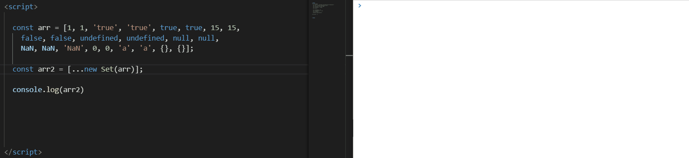
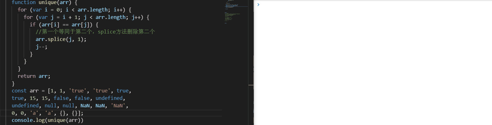
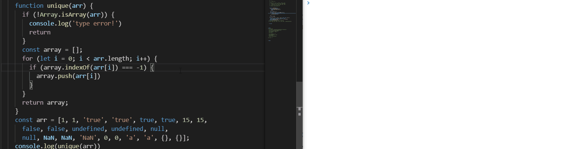
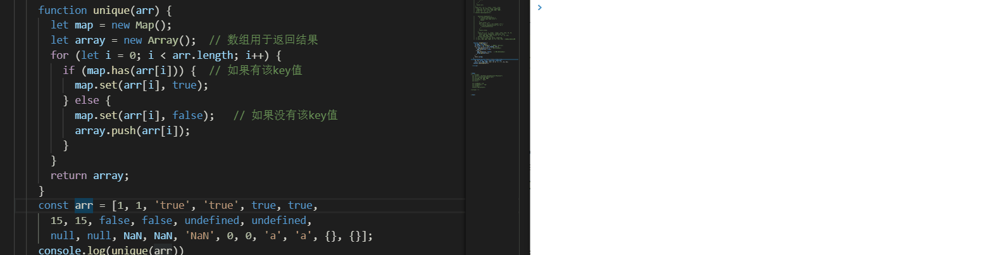
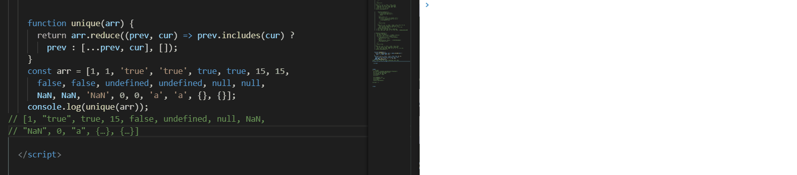
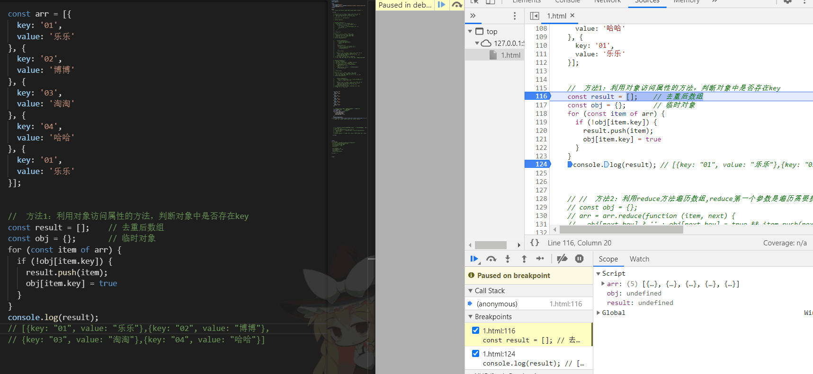
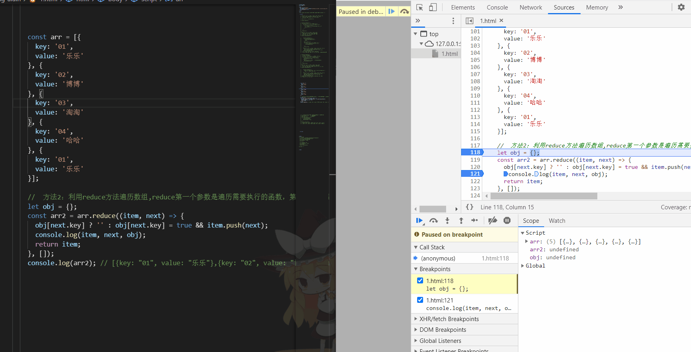

# 一、数组去重

## 1.利用ES6 Set去重（ES6中最常用）

```js
const arr = [1,1,'true','true',true,true,15,15,false,false, undefined,undefined, null,null, NaN, NaN,'NaN', 0, 0, 'a', 'a',{},{}];
const arr2=[...new Set(arr)]
console.log(arr2)
 //[1, "true", true, 15, false, undefined, null, NaN, "NaN", 0, "a", {}, {}]
```

**ps:不考虑兼容性，这种去重的方法代码最少。这种方法还无法去掉“{}”空对象，后面的高阶方法会添加去掉重复“{}”的方法。**

**动图如下：**



## 2.利用for嵌套for，然后splice去重（ES5中最常用）

```js
function unique(arr){            
        for(let i=0; i<arr.length; i++){
            for(let j=i+1; j<arr.length; j++){
                if(arr[i]==arr[j]){         //第一个等同于第二个，splice方法删除第二个
                    arr.splice(j,1);
                    j--;
                }
            }
        }
return arr;
}
const arr = [1,1,'true','true',true,true,15,15,false,false, undefined,undefined, null,null, NaN, NaN,'NaN', 0, 0, 'a', 'a',{},{}];
console.log(unique(arr))
    //[1, "true", 15, false, undefined, NaN, NaN, "NaN", "a", {…}, {…}]     //NaN和{}没有去重，两个null直接消失了
```

**ps:双层循环，外层循环元素，内层循环时比较值。值相同时，则删去这个值。**

**动图如下：**



## 3.利用indexOf去重

```js
function unique(arr) {
    if (!Array.isArray(arr)) {
        console.log('type error!')
        return
    }
    const array = [];
    for (let i = 0; i < arr.length; i++) {
        if (array .indexOf(arr[i]) === -1) {
            array .push(arr[i])
        }
    }
    return array;
}
const arr = [1,1,'true','true',true,true,15,15,false,false, undefined,undefined, null,null, NaN, NaN,'NaN', 0, 0, 'a', 'a',{},{}];
console.log(unique(arr)) 
 // [1, "true", true, 15, false, undefined, null, NaN, NaN, "NaN", 0, "a", {…}, {…}]  //NaN、{}没有去重
```

**ps:新建一个空的结果数组，for 循环原数组，判断结果数组是否存在当前元素，如果有相同的值则跳过，不相同则push进数组。**

**动图如下：**



## 4.利用Map数据结构去重

```
function arrayNonRepeatfy(arr) {
  let map = new Map();
  let array = new Array();  // 数组用于返回结果
  for (let i = 0; i < arr.length; i++) {
    if(map .has(arr[i])) {  // 如果有该key值
      map .set(arr[i], true); 
    } else { 
      map .set(arr[i], false);   // 如果没有该key值
      array .push(arr[i]);
    }
  } 
  return array ;
}
 const arr = [1,1,'true','true',true,true,15,15,false,false, undefined,undefined, null,null, NaN, NaN,'NaN', 0, 0, 'a', 'a',{},{}];
    console.log(unique(arr))
//[1, "a", "true", true, 15, false, 1, {…}, null, NaN, NaN, "NaN", 0, "a", {…}, undefined]
```

**ps:创建一个空Map数据结构，遍历需要去重的数组，把数组的每一个元素作为key存到Map中。由于Map中不会出现相同的key值，所以最终得到的就是去重后的结果。**

**动图如下：**



## 5.利用reduce+includes

```js
function unique(arr){
    return arr.reduce((prev,cur) => prev.includes(cur) ? prev : [...prev,cur],[]);
}
const arr = [1,1,'true','true',true,true,15,15,false,false, undefined,undefined, null,null, NaN, NaN,'NaN', 0, 0, 'a', 'a',{},{}];
console.log(unique(arr));
// [1, "true", true, 15, false, undefined, null, NaN, "NaN", 0, "a", {…}, {…}]
```

**动图如下：**



## 二、对象数组去重

```js
    const arr = [{
      key: '01',
      value: '乐乐'
    }, {
      key: '02',
      value: '博博'
    }, {
      key: '03',
      value: '淘淘'
    }, {
      key: '04',
      value: '哈哈'
    }, {
      key: '01',
      value: '乐乐'
    }];
```

## 1.采用对象访问属性的方法

```js
//  方法1：利用对象访问属性的方法，判断对象中是否存在key
    const result = [];
    const obj = {};
	for (const item of arr) {
      if (!obj[item.key]) {
        result.push(item);
        obj[item.key] = true
      }
    }
    console.log(result); // [{key: "01", value: "乐乐"},{key: "02", value: "博博"},{key: "03", value: "淘淘"},{key: "04", value: "哈哈"}]
```

**演示原理图：**




## 2.采用数组中的reduce方法

```js
 //  方法2：利用reduce方法遍历数组,reduce第一个参数是遍历需要执行的函数，第二个参数是item的初始值
    let obj = {};
    const arr2 = arr.reduce((item, next) => {
      obj[next.key] ? '' : obj[next.key] = true && item.push(next);
      console.log(item, next, obj);
      return item;
    }, []);
    console.log(arr2); // [{key: "01", value: "乐乐"},{key: "02", value: "博博"},{key: "03", value: "淘淘"},{key: "04", value: "哈哈"}]

```

**演示原理图：**



**ps:其中obj对象应该是{01:true,02:true,03:true,04:true}才对，页面上显示的可能有误**