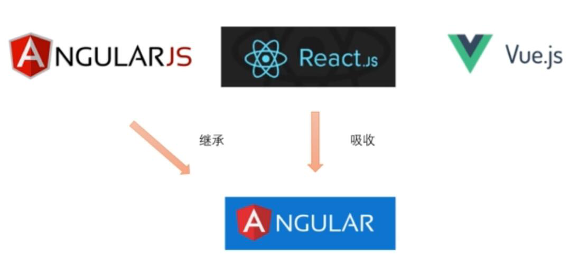
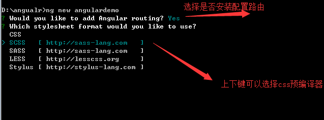
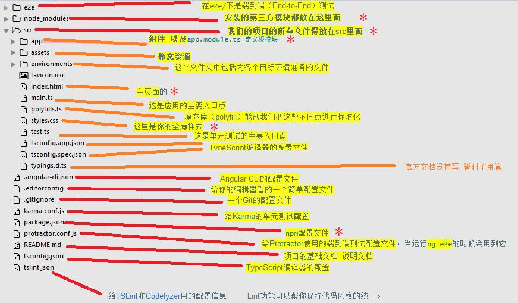
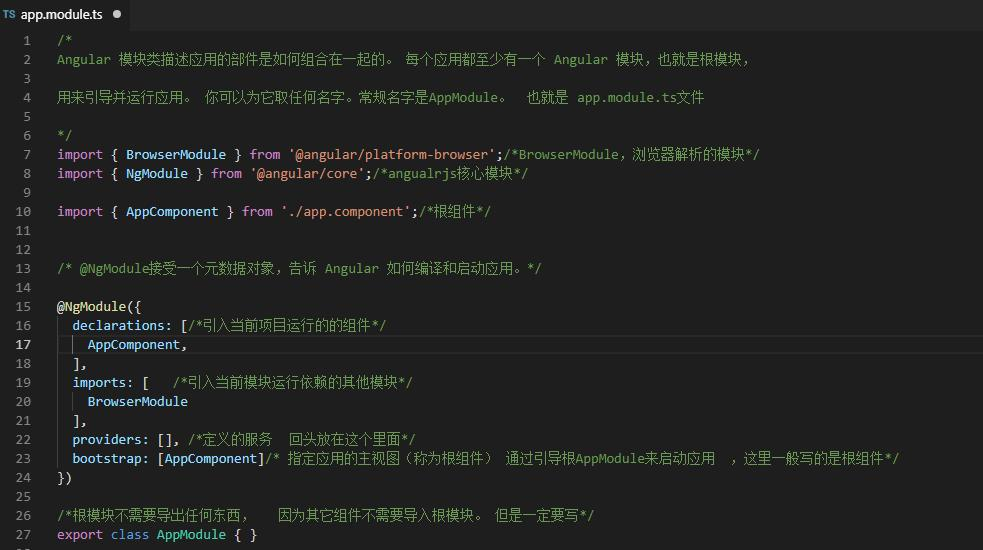
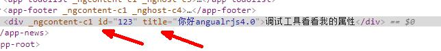
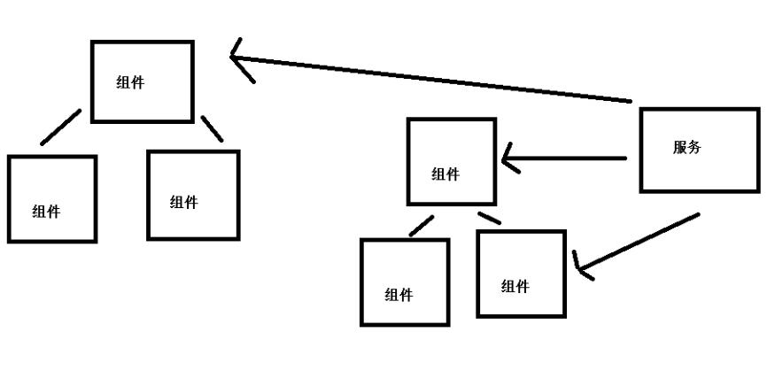

# 一、Angular配置与安装

## 1、Angular介绍

Angular是谷歌开发的一款开源的web前端框架，诞生于2009年，由**Misko Hevery** 等人创建，后为Google所收购。是一款优秀的前端JS框架，已经被用于Google的多款产品当中。

**根据项目数统计angular（1.x 、2.x 、4.x、5.x、6.x、7.x 、8.x、9.x）是现在网上使用量最大的框架。**

Angular基于TypeScript和react、vue相比 Angular更适合中大型企业级项目。

目前2019年12月25日**angular**最新版本angular9.x。根据官方介绍，Angular每过几个月就会更新一个版本。Angular2.x以后所有的Angular版本用法都是一样的，此教程同样适用于Angular7.x 、Angular8.x、Angular9.x 以及未来的其它版本....




## 2、学习Angular必备基础

**必备基础：**html  、css 、js、es6

如果有Typescript基础更容易理解，没有Typescript基础也可以学此教程。此教程中用到的Typescript语法会详细讲解。

**Typescript基础入门教程:** <https://www.itying.com/goods-905.html>


## 3、Angular环境搭建

**1、安装前准备工作：**

1. 1安装nodejs

   安装angular的计算机上面必须安装最新的nodejs--注意安装nodejs稳定版本

2. 2安装cnpm

   npm可能安装失败建议先用npm安装一下cnpm用淘宝镜像安装

   <https://npm.taobao.org/>

```js
npm install -g cnpm --registry=https://registry.npm.taobao.org
```

**2、使用 npm/cnpm 命令安装angular/cli  （只需要安装一次）**

```js
npm install -g @angular/cli     或者    cnpm install -g @angular/cli
```


## 4、Angular创建项目

1. **打开命令行工具找到你要创建项目的目录**

2. **创建项目**

   ng new 项目名称  

   **直接安装**

   ```js
   ng new angulardemo
   ```

   **如果要跳过npm i安装**

   ```js
   ng new angulardemo --skip-install
   ```

   

3. **运行项目**

   ```js
   cd angulardemo
   ```

   ```js
   ng serve --open
   ```


## 5、Angular环境搭建以及创建项目的时候可能遇到的错误

1. **npm安装angular/cli失败**

   解决方案：用 cnpm 安装

	. **创建项目npm i的时候失败**	

   解决方案1：ctrl+c结束项目，cd到项目里面，用 cnpm i 安装依赖

   解决方案2：创建项目的时候  --skip-install 

   ```js
   ng new my-app --skip-install 

   cd my-app

   cnpm install   /   yarn
   ```

3. **创建项目后用npm i 或者 cnpm i后项目没法运行**

   解决方案：用yarn 替代 cnpm和npm

   ​	1.cnpm instal @angular/cli (我的npm会报错)；

   ​	2.ng new 的时候阻止自动安装ng包，只创建ng目录     

   ```js
   ng new my-app --skip-install 
   ```

   ​	3.安装yarn      npm install -g yarn  或者   cnpm install -g yarn 

   ​	4.进入目录my-app 使用yarn 安装ng所依赖的包     yarn

   ​	**注意：**yarn命令等同于npm install / cnpm install    使用yarn前提是先安装yarn,安装使用cnpm install -g yarn就可以安装

# 二、Angular目录与结构

## 1、目录结构分析



## 2、app.module.ts、组件分析 

### 2.1 app.module.ts

定义 AppModule，这个根模块会告诉 Angular 如何组装该应用。 目前，它只声明了 AppComponent。 稍后它还会声明更多组件。 



### 2.2 自定义组件

- **创建组件：**

  ```js
  ng g component components/header
  ```

- **组件内容详解：**

  ```js
  import { Component, OnInit } from '@angular/core'; /*引入 angular 核心*/

  @Component({ 
  	selector: 'app-header', /*使用这个组件的名称*/ 
  	templateUrl: './header.component.html', /*html 模板*/ 
  	styleUrls: ['./header.component.css'] /*css 样式*/ 
  	})
  export class HeaderComponent implements OnInit { /*实现接口*/ 
  	constructor() { /*构造函数*/ 
  	
  	}
  	ngOnInit() { /*初始化加载的生命周期函数*/ 
  	
  	} 
  }
  ```

### 2.3 绑定数据

Angular 中使用{ {} }绑定业务逻辑里面定义的数据

```html
<h1>{ {title} } </h1>
<div [innerHTML]="h"></div>
```

```js
title:string='home works'
h:string="<h2>这是一个 h2 用[innerHTML]来解析</h2>"
id:number=123
msg:string='你好angularjs4.0'
```

### 2.4 绑定数据

```html
<div [id]="id" [title]="msg">调试工具看看我的属性</div>
```



## 3、数据循环 *ngFor

1. *ngFor  普通循环 

   ```html
   <ul>
       <li *ngFor="let item of list"> { {item} } </li>
   </ul>
   ```

2. 循环的时候设置 key

   ```html
   <ul>
       <li *ngFor="let item of list;let i = index;"> { {item} } --{ {i} } </li>
   </ul>
   ```

## 4、条件判断 *ngIf 

```html
<p *ngIf="list.length>3">这是 ngIF 判断是否显示</p>
```

## 5、*ngSwitch

```html
<ul [ngSwitch]="score">
    <li *ngSwitchCase="1">已支付</li>
    <li *ngSwitchCase="2">订单已经确认</li>
    <li *ngSwitchCase="3">已发货</li>
    <li *ngSwitchDefault>无效</li>
</ul>
```

## 6、执行事件 (click)=”getData()”

```html
<button class="button" (click)="getData()"> 点击按钮触发事件 </button>
<button class="button" (click)="setData()"> 点击按钮设置数据 </button>
```

```js
 getData() {
    /*自定义方法获取数据*/
    //获取 alert(this.msg); 
  }
  setData() {
    //设置值 this.msg='这是设置的值'; 
  }
```

## 7、表单事件

```html
//1.传统写法
<input type="text" (keyup)="keyUpFn($event)"/>
2.angular推荐写法
<input #input type="text" (keyup)="keyUpFn(input.value)"/>
```

```js
keyUpFn(e) {
    console.log(e)
  }
```

## 8、双向数据绑定

```html
<input [(ngModel)]="inputValue">
```

**Tips**:**需要单独引入FormsModule**

```js
import { FormsModule } from '@angular/forms';
```

```js
@NgModule({
  declarations: [
    AppComponent,
    HomeComponent,    
  ],
  imports: [
    BrowserModule,
    FormsModule
  ],
  providers: [RequestService],
  bootstrap: [AppComponent]
})
```

## 9、[ngClass]、[ngStyle]

```html
1.ngClass
<div [ngClass]="{'red': true, 'blue': false}"> 这是一个 div </div>
<ul>
  <li *ngFor="let item of arr, let i = index">
    <span [ngClass]="{'red': i==0}">{ {item} }</span>
  </li>
</ul>

2.ngStyle
<div [ngStyle]="{'background-color':'green'}">你好 ngStyle

</div>
<div [ngStyle]="{'background-color':attr}">你好 ngStyle</div> //attr是个变量 public attr=red
```

## 10、管道

```html
<p>{ {today | date:'yyyy-MM-dd HH:mm:ss' } }</p>
```

```js
public today=new Date();
```

[其他管道](http://bbs.itying.com/topic/5bf519657e9f5911d41f2a34)

# 三、Angular通信

## 1、angular服务

### 1.1 组件与服务关系图



### 1.2 创建服务命令

```js
ng g service my-new-service

//创建到指定目录下面
ng g service services/storage
```

### 1.3  app.module.ts 里面引入创建的服务

1. app.module.ts 里面引入创建的服务

   ```js
   import { StorageService } from './services/storage.service';
   ```

2. NgModule 里面的 providers 里面依赖注入服务

   ```js
   @NgModule({
     declarations: [
       AppComponent,
       HomeComponent,
       HighlightDirective,
       MsgformatPipe
     ],
     imports: [
       BrowserModule,
       FormsModule,
       HttpClientModule
     ],
     providers: [StorageService],
     bootstrap: [AppComponent]
   })

   export class AppModule { }
   ```

### 1.4 使用的页面引入服务，注册服务

```js
import { StorageService } from '../../services/storage.service';


constructor(private storage: StorageService) { }
```

调用服务中的(属性/方法)使用即可，例如：

```js
addData(){
	this.list.push(this.username);
	this.storage.set('todolist',this.list);
}
removerData(key){
	console.log(key);
    this.list.splice(key,1);
    this.storage.set('todolist',this.list);
}
```

# 四、页面监听

**第一步：引入模块**

```js
//  1.ElementRef需要引入
import { Component, OnInit, ElementRef, AfterViewInit} from '@angular/core';

//  2.fromEvent需要引入
import { fromEvent } from 'rxjs'
```

**第二步：注册ElementRef**

```js
constructor(
    private elementRef: ElementRef,
) { }
```

**第三步：获取dom元素**

```js
const dom = this.elementRef.nativeElement.querySelector('#{id}');
```

**第四步：在ngAfterViewInit中监听元素**

```js
ngAfterViewInit(): void {
    const dom = this.getGuideElement('inforContent');
    // 1.监听dom元素滚动
    this.subscribeScoll = fromEvent(dom, 'scroll')
      .subscribe((event) => {
        this.onWindowScroll();// 调用
      });
    // 2.监听页面尺寸变化
    this.listenWinWidth=fromEvent(window,'resize')
    .subscribe(e=>{
      const brightBlock = this.getGuideElement('bright')
      const introdueList = this.getGuideElement('introdueList')
      const triangleUp = this.getGuideElement('triangleUp')
      this.getAllelementInfo();
      this.getGuidePos(brightBlock, introdueList, triangleUp, this.introNum)
})
    
 // 获取元素节点
getGuideElement(data) {
    const value: any = this.elementRef.nativeElement.querySelector(`#${data}`);
    return value
}
```

